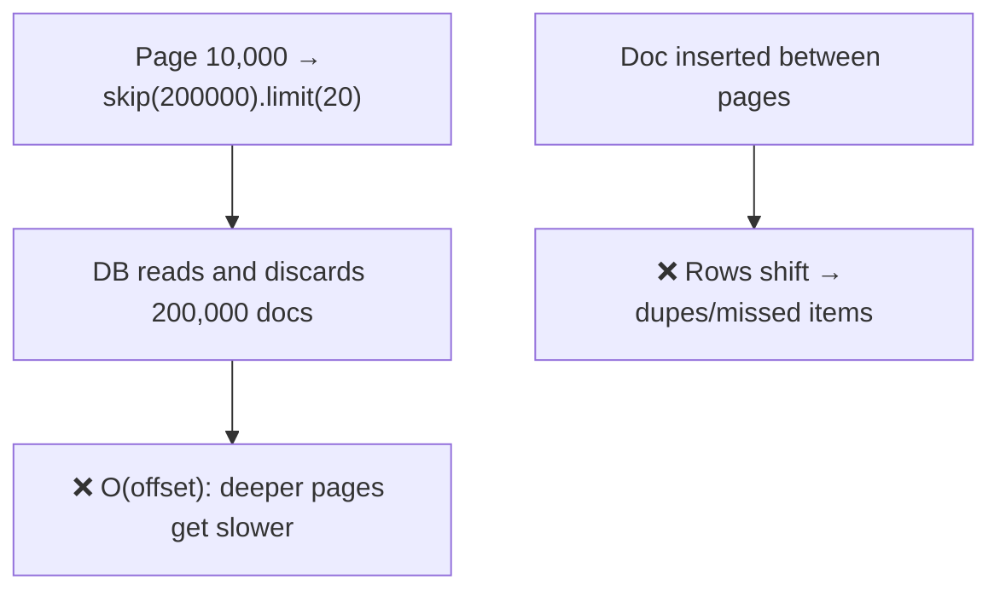
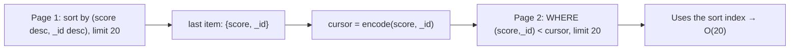

# 28. Cursor-Based Search Aggregation

> **In one line:** Build a fast MongoDB aggregation pipeline that filters by search tokens and paginates
> with a **cursor (keyset)** instead of `skip/limit` — so deep pages stay O(page size) and results don't
> drift as data changes underneath.

> **Original prompt:** Write a fast MongoDB aggregation pipeline that uses search tokens and supports
> cursor pagination.

## Overview

Two classic mistakes hide in "search + pagination": using `skip(n)` for deep pages (which forces the DB to
walk and discard `n` documents — O(n) and slower the deeper you go), and doing text matching in a way that
can't use an index. This problem combines **tokenized search** (indexable prefix/keyword matching) with
**cursor pagination** (resume from the last-seen sort key) to get predictable, fast, stable paging.

## Functional Requirements

- Search documents by tokens (words/prefixes) with optional filters.
- Return results sorted by a stable key (relevance/date/id), paginated.
- "Next page" resumes exactly where the last ended, with no duplicates/skips even as data changes.
- Consistent performance regardless of page depth.

## Non-Functional Requirements

| Property | Target |
|---|---|
| Page latency | O(page size), independent of offset depth |
| Stability | No drift/dupes when documents are inserted/deleted between pages |
| Index usage | Search + sort backed by indexes, not collection scans |
| Scale | Millions of documents |

## Why `skip/limit` Fails at Depth



`skip` must count past every skipped document; deep offsets are slow, and any insert/delete shifts the
window, causing duplicates or gaps. Cursor pagination fixes both.

## Cursor (Keyset) Pagination

Instead of "skip N," remember the **sort key of the last item** and ask for items *after* it:



- The cursor encodes the **full sort key** (must include a unique tiebreaker like `_id` so it's total
  order — otherwise items with equal scores break paging).
- "Next" = `find items strictly after the cursor in sort order, limit K`. It seeks into the index and
  reads K docs — **independent of depth**.
- Stable: new inserts don't shift your position; you always continue from a concrete key.

## The Aggregation Pipeline (search tokens + cursor)

```js
// Assume documents store a `tokens` array (lowercased words/prefixes) with a multikey index,
// plus a compound index supporting the sort+cursor: { score: -1, _id: -1 }
db.docs.aggregate([
  // 1) token match — indexable equality on the multikey `tokens` field
  { $match: {
      tokens: { $all: searchTokens },          // AND of tokens (or $in for OR)
      ...filters,                               // category, status, etc.
      // 2) cursor predicate: everything strictly after the last-seen key
      ...(cursor && { $or: [
        { score: { $lt: cursor.score } },
        { score: cursor.score, _id: { $lt: cursor._id } }   // tiebreaker
      ]})
  }},
  { $sort: { score: -1, _id: -1 } },            // same order as the cursor
  { $limit: pageSize + 1 }                       // +1 to detect "has next page"
]);
// build nextCursor from the last returned doc; drop the extra sentinel doc
```

Key points: the `$match` (tokens + cursor) comes **first** so indexes prune early; the `$sort` matches the
cursor order and is index-backed; `limit+1` cheaply tells you whether a next page exists.

## Tokenization Choices

| Approach | How | Trade-off |
|---|---|---|
| **Token array + multikey index** | Precompute lowercased tokens/prefixes, `$all`/`$in` match | Fast, index-friendly; you control tokenization |
| **MongoDB `$text` index** | Built-in stemming, `$text` + `textScore` | Easy; less control, `textScore` sort needs care with cursors |
| **Atlas Search / Elasticsearch** | Real inverted index, relevance, fuzzy, facets | Best search quality; extra infra |

For prefix/typeahead-style token search, a **prefixed token array + multikey index** is fast and
predictable. For rich relevance, an external search engine is better (see problem 13/11).

## Sorting by Relevance with Cursors

Cursoring on a computed relevance score is trickier (the score must be stable and stored/deterministic).
Common patterns: sort by a **stored** score + `_id` tiebreaker, or paginate by `_id`/date when relevance
ties are acceptable. If using `$text` `textScore`, materialize it into a field you can cursor on, or fall
back to search-engine pagination which handles scored cursors natively.

## Scaling & Failure Scenarios

| Scenario | Response |
|---|---|
| Deep pagination | Cursor keeps it O(page size) at any depth |
| Data changes mid-scroll | Keyset continues from a concrete key → no dupes/skips |
| Large token intersections | Ensure multikey + compound indexes cover match+sort; consider search engine |
| Sort key not unique | Always append `_id` (or another unique field) as a tiebreaker |
| Backward paging | Reverse the comparison and sort, then re-reverse results |

## Security

- Validate/limit `pageSize`; reject absurd values (DoS via huge limits).
- Sign or opaquely encode cursors so clients can't tamper to read unauthorized ranges; apply the same
  auth filters on every page.
- Sanitize search tokens (injection into query operators); never build queries from raw strings.

## Performance

- Index for the exact access pattern: multikey on `tokens`, compound on the sort/cursor keys.
- `$match` before `$sort/$limit`; verify with `explain()` that it's an index scan, not `COLLSCAN`.
- `limit + 1` avoids a separate count for "has next"; avoid `count()` on every page.

## Trade-offs & Pitfalls

- **`skip/limit` for deep pages** → O(offset) slowness and drift; use keyset cursors.
- **Cursor without a unique tiebreaker** → items with equal sort values get skipped/duplicated.
- **`$sort` not matching the cursor order** → wrong/incoherent pages.
- **Sorting on an unindexed field** → in-memory sort, blow-ups on big result sets.
- **Exposing raw offsets/cursors** → tampering; sign/encode and re-apply auth filters.

## Interview Questions & Answers

- **Why not `skip/limit`?** Deep offsets force the DB to walk and discard N docs (O(offset)), and inserts
  shift the window → duplicates/gaps.
- **How does cursor pagination work?** Encode the last item's full sort key; the next page selects items
  strictly after it in sort order, limited — an index seek, O(page size).
- **Why include `_id` in the cursor?** To make the sort key a total order; without a tiebreaker, equal
  values break paging.
- **How do you make token search fast?** A multikey-indexed `tokens` array matched with `$all`/`$in`, or
  `$text`/Atlas Search/Elasticsearch for richer relevance.
- **Where does the cursor predicate go in the pipeline?** In the first `$match`, before `$sort`/`$limit`,
  so indexes prune early.
- **How do you know there's a next page?** Fetch `limit + 1`; the extra doc signals more and seeds the next
  cursor.
