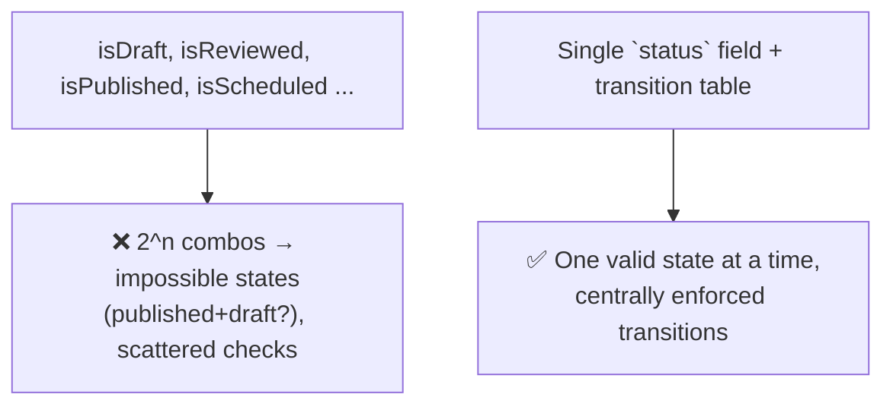
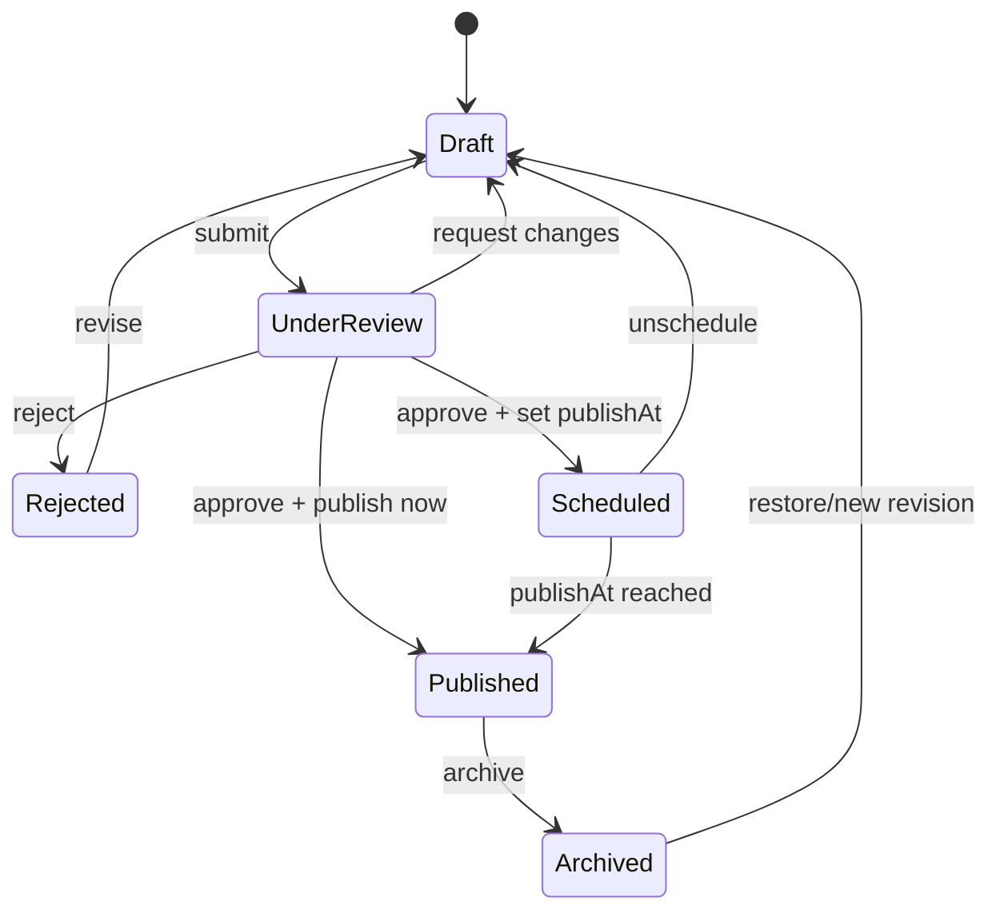
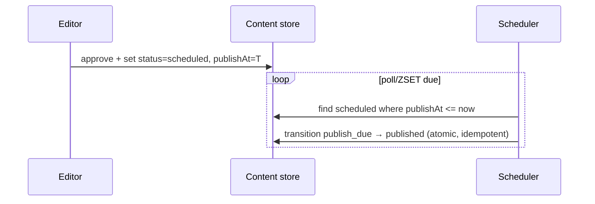

# 29. Live Content Management Workflow

> **In one line:** Model an editorial workflow as an explicit **state machine** — draft → under review →
> scheduled → published (→ archived) — with legal-transition enforcement, scheduled publishing, and
> revision history, so content moves through approval safely and predictably.

> **Original prompt:** Create a schema and logic tracking draft, under-review, scheduled, and published
> states.

## Overview

Content doesn't just exist; it moves through a **lifecycle** with rules: an author drafts, an editor
reviews, someone schedules it, and it goes live at a set time. Modeling this ad hoc (a pile of booleans:
`isDraft`, `isPublished`, `isReviewed`) produces impossible states and buggy transitions. The clean design
is a **finite state machine (FSM)**: enumerate states, define which transitions are legal, and enforce
them centrally. This makes the workflow auditable, extensible, and correct.

## Functional Requirements

- States: **Draft, Under Review, Scheduled, Published, Archived** (and Rejected).
- Enforce **legal transitions** (e.g., can't jump Draft → Published without review).
- **Scheduled publishing:** go live automatically at `publishAt`.
- **Revision history:** track edits and who changed state when.
- Role-based permissions (author submits, editor approves/publishes).

## Non-Functional Requirements

| Property | Target |
|---|---|
| Correctness | No illegal state; every transition validated |
| Auditability | Full history of state changes (who/when/why) |
| Reliability | Scheduled content publishes on time even across restarts |
| Extensibility | Add states/steps without rewriting core logic |

## Why a State Machine (not booleans)



A single `status` enum plus an explicit transition table eliminates contradictory flags and centralizes
the rules.

## The State Machine



- Each arrow is a **named transition** with a guard (permission + precondition). Anything not drawn is
  illegal and rejected.
- Transitions are the only way `status` changes — no direct field writes.

## Schema & Transition Logic

```js
// content doc
{
  _id, title, body,
  status: "draft",                 // enum: draft|under_review|scheduled|published|rejected|archived
  publishAt: null,                 // for scheduled
  publishedAt: null,
  version: 3,
  history: [ /* { from, to, by, at, note } */ ],
}

const TRANSITIONS = {
  draft:        { submit: "under_review" },
  under_review: { approve_publish: "published", approve_schedule: "scheduled",
                  request_changes: "draft", reject: "rejected" },
  scheduled:    { publish_due: "published", unschedule: "draft" },
  published:    { archive: "archived" },
  rejected:     { revise: "draft" },
  archived:     { restore: "draft" },
};

function transition(doc, action, user) {
  const next = TRANSITIONS[doc.status]?.[action];
  if (!next) throw new Error(`Illegal transition: ${doc.status} --${action}-->`);
  assertPermission(user, action);                 // RBAC guard
  doc.history.push({ from: doc.status, to: next, by: user.id, at: new Date() });
  doc.status = next;
  return doc;
}
```

Centralizing transitions in one function/table means every state change is validated, permission-checked,
and **audited** in one place.

## Scheduled Publishing

Going live at `publishAt` is a **distributed scheduler** problem (see problem 10):



- A durable scheduler (indexed `publishAt`, or a Redis ZSET scored by time) flips due content to
  `published` — exactly-once via an atomic claim so multiple workers don't double-publish.
- Idempotent transition (guard on current status) so a retried job is safe.

## Revisions & History

- Keep an append-only **history** of transitions (who/when/note) for audit and rollback.
- For body edits, store **revisions** (versioned copies or diffs) so you can revert or show "what
  changed." Editing a published item often means creating a **new draft revision** rather than mutating
  the live copy (so the live version stays stable until re-published).

## Scaling & Failure Scenarios

| Scenario | Response |
|---|---|
| Scheduled publish must fire reliably | Durable scheduler + atomic claim + idempotent transition |
| Concurrent edits/transitions | Optimistic locking (`version`) to prevent lost updates (problem 14) |
| Worker restarts during scheduled window | Poll picks up overdue items; `last_run`/status guards prevent dupes |
| Adding a new workflow step | Extend the transition table + FSM; no core rewrite |
| High read traffic on published content | Serve published from cache/CDN; drafts from the app |

## Security

- **RBAC per transition:** authors submit, editors approve/publish, admins archive — enforce in the
  transition guard, not the UI.
- Only **published** content is publicly readable; drafts/scheduled are restricted.
- Audit trail of state changes (immutable history) supports accountability/compliance (see problem 33).

## Performance

- A single indexed `status` (+ `publishAt`) field powers workflow queues ("what's under review",
  "what's due").
- Cache/CDN the published surface; the workflow machinery only touches unpublished items.
- Publish is an O(1) status flip; heavy rendering/denormalization can be a post-publish async step.

## Trade-offs & Pitfalls

- **Boolean flags instead of an FSM** → impossible states and scattered, inconsistent checks.
- **Allowing direct `status` writes** → bypasses guards/audit; force all changes through transitions.
- **Naive scheduled publish** (single cron/in-memory timer) → missed or duplicated publishes; use a
  durable, atomic scheduler.
- **Editing the live copy directly** → readers see half-edited content; edit a new revision.
- **No history** → no audit/rollback; append transition + revision records.

## Interview Questions & Answers

- **Why a state machine over booleans?** Booleans allow contradictory states (published *and* draft); an
  FSM guarantees one valid state and centrally enforced transitions.
- **How do you enforce legal transitions?** A transition table + a single `transition()` function that
  validates the move, checks permissions, and records history.
- **How does scheduled publishing work?** A durable scheduler (indexed `publishAt` / Redis ZSET) flips due
  items to published via an atomic, idempotent claim (exactly-once).
- **How do you handle concurrent edits?** Optimistic locking on a `version` field to avoid lost updates.
- **How do you edit already-published content safely?** Create a new draft revision; keep the live version
  stable until re-published.
- **How is this auditable?** Append-only history of transitions (who/when/why) + content revisions.
