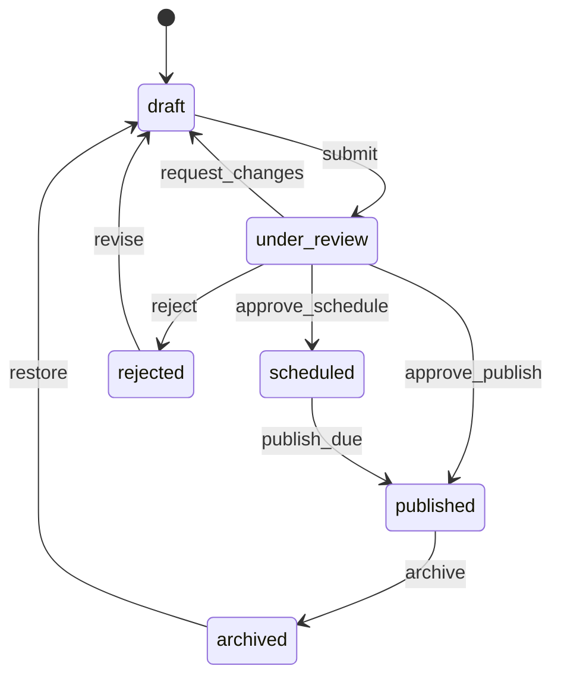

# Live Content Management Workflow — implementation

An editorial workflow as a finite state machine, implementing the
[design doc](../29-live-content-management-workflow.md): `draft → under_review → scheduled → published →
archived` with enforced transitions, scheduled publishing, and history.

## Stack

- **Node.js + TypeScript + Express**
- **MongoDB** (with `optimisticConcurrency` guarding concurrent transitions)

## State machine



## Endpoints

| Method | Path | Purpose |
| --- | --- | --- |
| POST | `/api/content` `{title, body}` | Create a draft |
| GET | `/api/content/:id` | Fetch content + history |
| POST | `/api/content/:id/transition` `{action, publishAt?, by}` | Perform a validated transition |

## Design-doc mapping

- **FSM over booleans** → a single `status` + `TRANSITIONS` table; `nextStatus` rejects illegal moves →
  no impossible states.
- **Transitions are the only mutation** → each records a `history` entry (who/when/action) for audit.
- **Scheduled publishing** → a poller flips due `scheduled` content to `published` via an atomic,
  idempotent guard (`status:'scheduled'`).
- **Concurrency** → `optimisticConcurrency` (`__v`) prevents lost updates on concurrent transitions.

## Run it

```bash
docker compose up --build          # http://localhost:3129
```

```bash
npm install && npm test            # 4 unit tests (legal/illegal transitions)
npm run typecheck
```

## Verification

- `npm test` covers legal transitions, illegal-transition rejection, review bounce/reject, and
  re-entry from rejected/archived. `npm run typecheck` passes. Scheduled publish runs under `docker
  compose up`.
