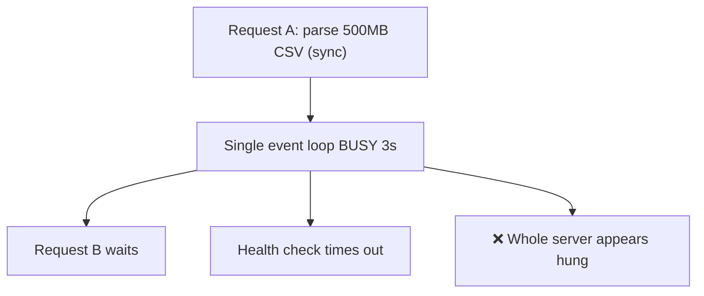
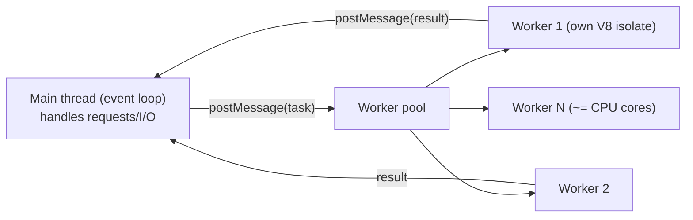
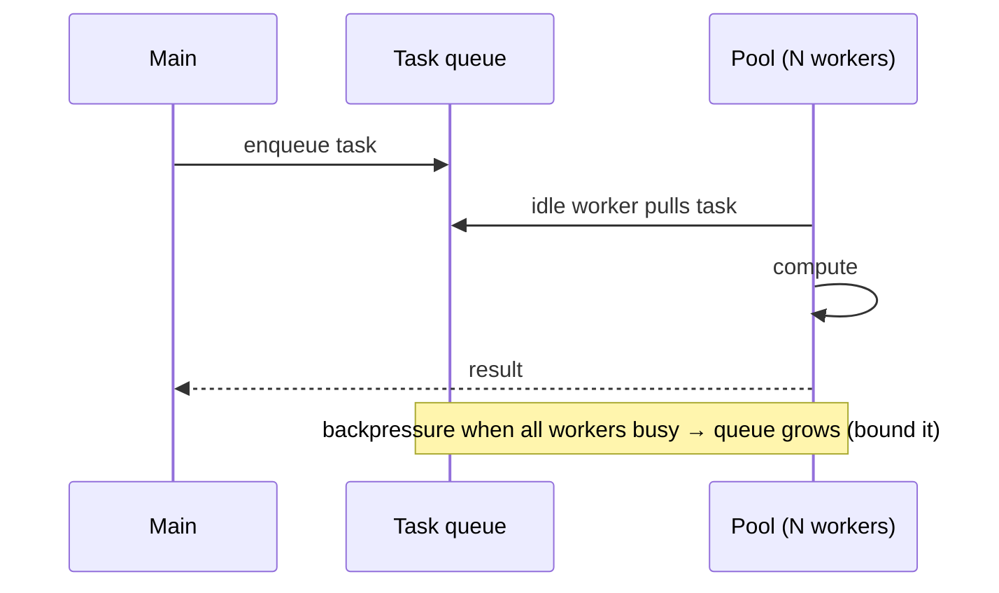
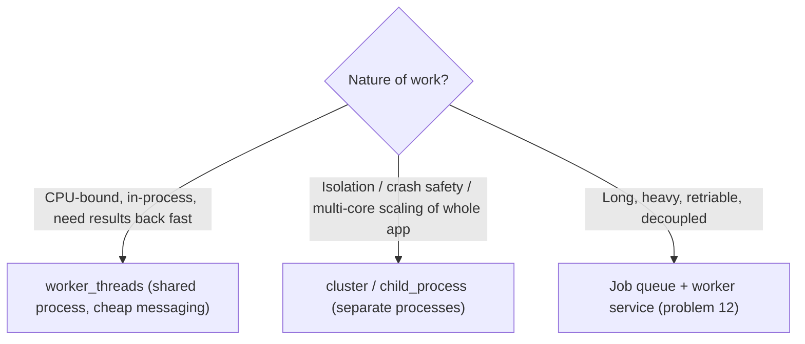

# 30. Worker Threads for Heavy Computation

> **In one line:** Move CPU-bound work (parsing a huge CSV, hashing, image/crypto math) off the single
> Node.js event loop into `worker_threads` — so one heavy request can't freeze every other request — and
> know when to use threads vs a separate process/queue instead.

> **Original prompt:** Write a Node.js module that offloads heavy CSV parsing to a background thread to
> prevent event-loop blocking.

## Overview

Node.js runs your JavaScript on **one thread** with an event loop. That's great for I/O concurrency (async
I/O doesn't block), but disastrous for **CPU-bound** work: a synchronous 3-second CSV parse blocks the
*entire* process — every other request stalls, health checks time out, the server looks dead. The fix is
`worker_threads`: real OS threads that run JS in parallel, so heavy computation happens off the main loop.
The nuance is knowing **which problems** are threads-shaped (CPU) versus I/O-shaped (already fine async).

## Functional Requirements

- Offload CPU-heavy tasks (CSV/JSON parsing, compression, hashing, image transforms) to background
  threads.
- Keep the main event loop responsive to other requests during heavy work.
- Return results/errors back to the caller; support many concurrent heavy tasks via a pool.

## Non-Functional Requirements

| Property | Target |
|---|---|
| Responsiveness | Main loop stays free; p99 of unrelated requests unaffected |
| Throughput | Parallelism up to CPU core count |
| Overhead | Reuse threads (pool); avoid per-task thread spawn cost |
| Safety | Isolate crashes; bound memory/time per task |

## The Problem: One Blocked Loop Freezes Everything



Async I/O wouldn't help here — the CPU work itself occupies the loop. You need **parallel execution**.

## worker_threads Model



- Each worker has its **own V8 isolate + event loop + memory** — no shared JS heap, so no data races on
  ordinary variables. Communication is via **message passing** (`postMessage`), which **structured-clones**
  data (a copy), or via **transferables**/`SharedArrayBuffer` for zero-copy of large binary buffers.
- Spawn `~= number of CPU cores` workers (more than cores just context-switches).

## Implementation: offload CSV parsing

```js
// main.js — dispatch to a worker, stay non-blocking
import { Worker } from 'node:worker_threads';

function parseCsvOffThread(filePath) {
  return new Promise((resolve, reject) => {
    const worker = new Worker('./csv-worker.js', { workerData: { filePath } });
    worker.once('message', resolve);
    worker.once('error', reject);
    worker.once('exit', (code) => { if (code !== 0) reject(new Error(`worker exit ${code}`)); });
  });
}
// the main event loop is free to serve other requests while this runs
app.get('/upload/:id', async (req, res) => res.json(await parseCsvOffThread(pathFor(req.params.id))));
```

```js
// csv-worker.js — runs on its own thread
import { workerData, parentPort } from 'node:worker_threads';
import { readFileSync } from 'node:fs';
const rows = heavyParse(readFileSync(workerData.filePath, 'utf8'));  // CPU-bound work here
parentPort.postMessage({ count: rows.length, summary: summarize(rows) });
```

## Use a Pool (don't spawn per task)

Creating a worker has startup cost (a new V8 isolate). For frequent tasks, keep a **pool** of reusable
workers and a task queue:



Libraries like **Piscina** implement this well. Bound the queue and apply backpressure so a flood of heavy
tasks doesn't exhaust memory.

## Threads vs Processes vs Queue — choosing



| Option | When |
|---|---|
| **worker_threads** | CPU-bound tasks needing shared-ish memory / fast result return within the service |
| **cluster / child_process** | Scale the whole app across cores; strong isolation; heavier IPC |
| **External job queue** | Long-running, retriable, decoupled batch work (transcoding, big imports) — see problem 12 |

If the CSV is huge and processing can be async/eventual, a **queue + worker service** is often better than
in-process threads (durable, retriable, scalable independently). Threads shine for latency-sensitive
CPU bursts you want to answer within the request.

## Scaling & Failure Scenarios

| Scenario | Response |
|---|---|
| Many heavy tasks at once | Pool sized to cores + bounded queue; backpressure/reject when saturated |
| Worker crashes | Isolated — main survives; pool respawns; return error to caller |
| Runaway task (huge file) | Per-task time/memory limits; terminate the worker |
| Passing big data | Use transferables/`SharedArrayBuffer` to avoid clone cost |
| Need durability/retries | Prefer an external queue over in-memory threads |

## Security

- Validate/limit input size **before** dispatch (a 5 GB CSV can OOM a worker); cap rows/bytes.
- Treat file contents as untrusted; sandbox parsing; never `eval` data.
- Bound CPU/memory/time per worker to prevent a malicious upload from DoS-ing the pool.

## Performance

- Parallelism up to core count; beyond that, more workers just thrash.
- Reuse workers (pool) to amortize isolate startup.
- Minimize message-passing copies: transfer buffers instead of cloning large payloads.

## Trade-offs & Pitfalls

- **Doing CPU work on the main thread** → freezes the whole event loop and every request.
- **Spawning a worker per task** → startup overhead dominates; use a pool.
- **Unbounded task queue** → memory blowup under load; bound + backpressure.
- **Threads for I/O-bound work** → pointless; async I/O already doesn't block.
- **Assuming shared memory like real threads** → JS heaps are isolated; communicate via messages/
  `SharedArrayBuffer`.
- **No input limits** → a giant upload OOMs a worker (DoS).

## Interview Questions & Answers

- **Why does CPU work hurt Node?** The event loop is single-threaded; synchronous CPU work blocks *all*
  requests until it finishes.
- **How do worker_threads help?** They run JS on separate OS threads with their own isolates, so heavy
  computation runs in parallel and the main loop stays responsive.
- **Do workers share memory?** No shared JS heap by default — they message-pass (structured clone); use
  transferables/`SharedArrayBuffer` for zero-copy of big buffers.
- **Why a pool?** Worker creation is costly; a fixed pool + task queue reuses threads and bounds parallelism
  to core count.
- **Threads vs a job queue?** Threads for latency-sensitive CPU bursts answered in-request; an external
  queue for long, retriable, decoupled batch work.
- **When are worker_threads the wrong tool?** For I/O-bound work (async already suffices) or when you need
  durability/retries (use a queue).
