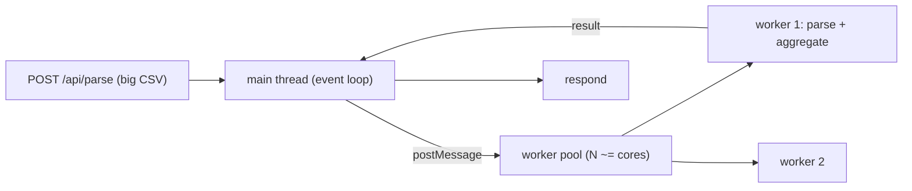

# Worker Threads for Heavy Computation — implementation

Offloads CPU-bound CSV parsing/aggregation to a **worker_threads pool**, implementing the
[design doc](../30-worker-threads-heavy-computation.md), so the Express event loop stays responsive under
heavy requests.

## Stack

- **Node.js + TypeScript + Express** (built-in `node:worker_threads`)

## Architecture



## Endpoints

| Method | Path | Purpose |
| --- | --- | --- |
| GET | `/api/health` | Liveness + pool size |
| POST | `/api/parse?sum=col` (CSV body) | Parse + optional column sum, done on a worker |

## Design-doc mapping

- **Off the event loop** → CPU-heavy parse/aggregate runs on a worker, not the main thread → other
  requests stay responsive.
- **Reusable pool** → long-lived workers receive tasks via `postMessage` (avoids per-task startup);
  tasks beyond pool size queue (backpressure).
- **Message passing** → main ↔ worker communicate by messages (isolated heaps).
- **Dev/prod worker path** → resolves `worker.ts` (tsx) or `worker.js` (built) automatically.

## Run it

```bash
docker compose up --build          # http://localhost:3130
printf 'name,amount\na,10\nb,20\n' | curl -s --data-binary @- -H 'content-type: text/csv' 'localhost:3130/api/parse?sum=amount'
```

```bash
npm install && npm test            # 4 unit tests (CSV parse + column sum)
npm run typecheck
```

## Verification

- `npm test` covers header/row parsing, empty input, numeric column sum, and non-numeric handling.
  `npm run typecheck` passes. The worker pool runs the actual offloaded parse under `docker compose up`.
