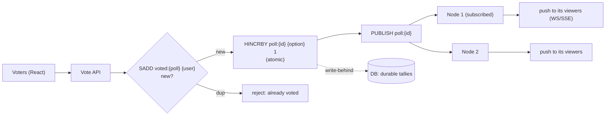
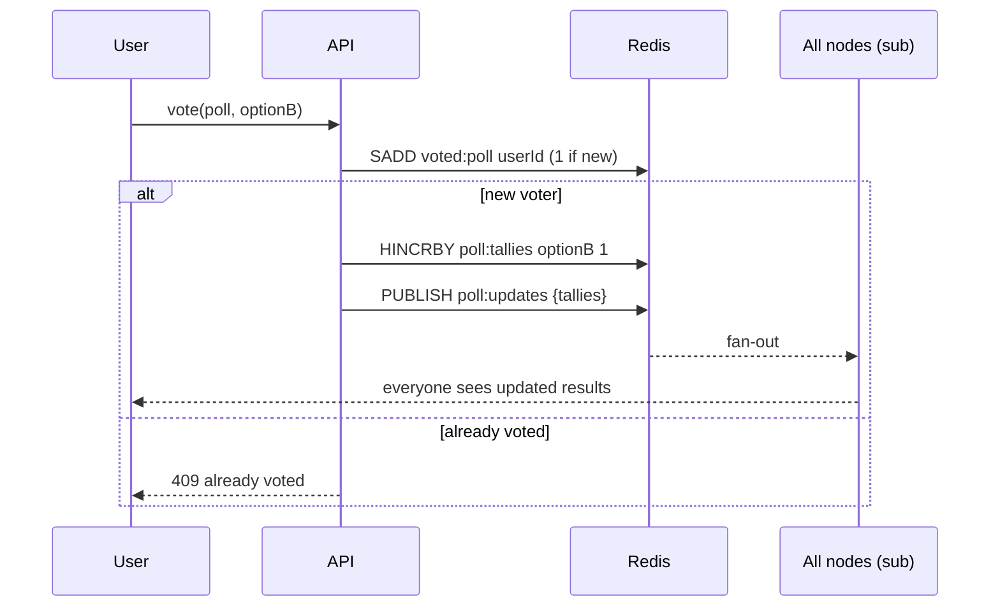

# 31. Design a Real-Time Polling App

> **In one line:** Accept thousands of votes per second and push live tallies to every connected viewer —
> combining atomic counters (Redis), pub/sub fan-out, and one-vote-per-user enforcement — so results
> update instantly without hammering the database or allowing ballot stuffing.

> **Original prompt:** Build a live voting system using React, Node.js, and Redis pub/sub to handle
> thousands of votes per second.

## Overview

A live poll is two problems married together: a **high-throughput write counter** (like problem 06's
likes) and a **real-time broadcast** (like problem 01's chat fan-out). Votes pour in and must be counted
atomically and idempotently (one vote per user); results must stream to every watcher within a second.
The design keeps the hot path in Redis (atomic increments + pub/sub) and treats the database as durable
truth updated asynchronously.

## Functional Requirements

- Cast a vote for an option; enforce **one vote per user** (or a defined policy).
- Show **live** aggregate results to all connected clients as votes arrive.
- Support many concurrent polls and viewers.
- Persist final/rolling results durably.

## Non-Functional Requirements

| Property | Target |
|---|---|
| Write throughput | Thousands of votes/sec/poll without DB lock contention |
| Broadcast latency | Results visible to viewers within ~1 s |
| Integrity | One vote per user; no double counting; no ballot stuffing |
| Scale | Many concurrent WebSocket/SSE viewers across instances |

## Architecture

Two Redis roles: **atomic counters** (the tally) and **pub/sub** (fan-out to all server instances, each
of which pushes to its connected clients).

## The Vote Path (atomic + idempotent)

- **Idempotency:** `SADD voted:{poll} {user}` returns 1 only the first time → gate the increment on it
  (mirrors the like-system pattern). Prevents double voting on retries/double-clicks.
- **Atomic tally:** `HINCRBY` on a Redis hash (option → count) is O(1), lock-free.
- **Fan-out:** publish the new tallies to a channel; every server instance subscribed pushes to its
  WebSocket/SSE clients — so a vote on node 1 updates viewers on node 3.

## Live Delivery to Viewers

- Since results are **one-way, server→client**, **SSE** is a great fit (see problem 27); WebSocket if you
  also need client→server messaging.
- Connections are stateful across many nodes → the Redis pub/sub **backplane** lets any node broadcast to
  all viewers (same pattern as the chat system, problem 01).
- **Coalesce updates:** at thousands of votes/sec you don't push per-vote; broadcast the aggregate every
  ~250–500 ms (throttle) so clients get smooth updates without message floods.

## Persistence & Truth

- Redis holds the hot tally; write-behind to the DB periodically (and on poll close) for durability.
- On Redis loss, rebuild counters from the durable vote records (or accept approximate live counts +
  reconcile). Keep individual vote records in the DB if you need auditability/recount.

## One-Vote Policy Variants

| Policy | Enforcement |
|---|---|
| Authenticated one-vote | `voted:{poll}` set keyed by userId (server-derived) |
| Anonymous (best-effort) | Device/cookie + IP heuristics (weak; spoofable) |
| Change-your-vote allowed | Track prior choice; `HINCRBY -1` old, `+1` new, update the set entry |

Truly abuse-resistant voting requires authentication; anonymous polls are inherently gameable.

## Scaling & Failure Scenarios

| Scenario | Response |
|---|---|
| Vote spike (viral poll) | Redis atomic increments absorb it; DB via write-behind |
| Many viewers across nodes | Pub/sub backplane + horizontally-scaled SSE/WS nodes |
| Update flood to clients | Throttle/coalesce broadcasts (aggregate every ~500 ms) |
| Redis failure | AOF/replica; rebuild tallies from durable votes; reconcile |
| Ballot stuffing | Auth + per-user set + rate limiting + anomaly detection |
| Hot poll key | Single hash is fine for HINCRBY; replicate for read; shard if extreme |

## Security

- Server-authoritative user identity for the one-vote set; never trust a client-sent user id.
- Rate-limit vote attempts per user/IP; detect bot patterns (uniform bursts, one IP many accounts).
- Validate the option belongs to the poll; reject closed/expired polls.

## Performance

- Vote = one `SADD` + one `HINCRBY` (both O(1)); zero DB contact on the hot path.
- Reads/live updates come from Redis + push, not DB polling.
- Coalesced broadcasts keep client and network load bounded under high vote rates.

## Trade-offs & Pitfalls

- **Synchronous DB `UPDATE ... count+1`** → hot-row lock meltdown; use Redis atomic counters.
- **No idempotency set** → double votes from retries/double-clicks.
- **Broadcasting every single vote** → floods clients; throttle aggregates.
- **Per-node in-memory fan-out** → viewers on other nodes miss updates; use pub/sub backplane.
- **Write-behind without durability** → lost votes on Redis crash; AOF/replica + reconcile from records.

## Interview Questions & Answers

- **How do you handle thousands of votes/sec?** Atomic Redis counters (`HINCRBY`), no DB lock; write-behind
  to the DB.
- **How do you enforce one vote per user?** `SADD voted:{poll} {user}` returns 1 only once; gate the
  increment on it.
- **How do live results reach everyone?** Publish new tallies to Redis pub/sub; every server instance pushes
  to its SSE/WebSocket clients.
- **Why not push every vote to clients?** It floods them; coalesce and broadcast the aggregate a few times
  a second.
- **What's the source of truth?** The DB (durable votes/tallies via write-behind); Redis is the hot,
  rebuildable serving layer.
- **How do you stop ballot stuffing?** Authentication + per-user set + rate limiting + anomaly detection.
