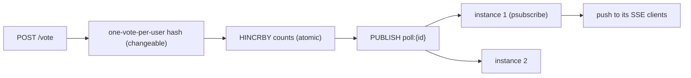

# Real-Time Polling App — implementation

Live voting implementing the [design doc](../31-real-time-polling-app.md): **atomic Redis vote
counters** + a one-vote-per-user set, with results **fanned out across instances via Redis pub/sub** and
pushed to clients over **SSE**.

## Stack

- **Node.js + TypeScript + Express**
- **Redis** — `HINCRBY` counters, per-user vote hash, pub/sub for cross-instance fan-out

## Architecture



## Endpoints

| Method | Path | Purpose |
| --- | --- | --- |
| POST | `/api/polls` `{question, options}` | Create a poll |
| POST | `/api/polls/:id/vote` `{userId, option}` | Vote (idempotent, changeable) |
| GET | `/api/polls/:id` | Current results |
| GET | `/api/polls/:id/stream` | Live results (SSE) |

## Design-doc mapping

- **High-throughput counters** → atomic `HINCRBY`, no DB lock.
- **One vote per user** → per-user vote hash; `voteDeltas(prev,next)` computes correct increments
  (switch = −old +new; re-vote = no-op).
- **Cross-instance live results** → publish to a Redis channel; every instance `psubscribe`s and pushes
  to its own SSE clients (so a vote on any node updates all viewers).

## Run it

```bash
docker compose up --build          # http://localhost:3131  (scale: --scale app=3 behind an LB)
```

```bash
npm install && npm test            # 4 unit tests (vote deltas + totals)
npm run typecheck
```

## Verification

- `npm test` covers first/change/no-op vote deltas and totals. `npm run typecheck` passes. Atomic
  counting + pub/sub live results run against Redis under `docker compose up`.
