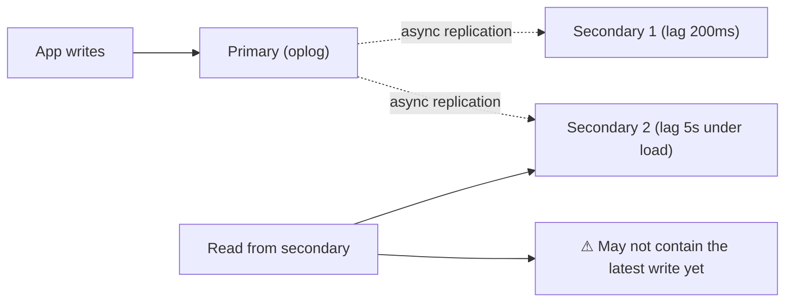
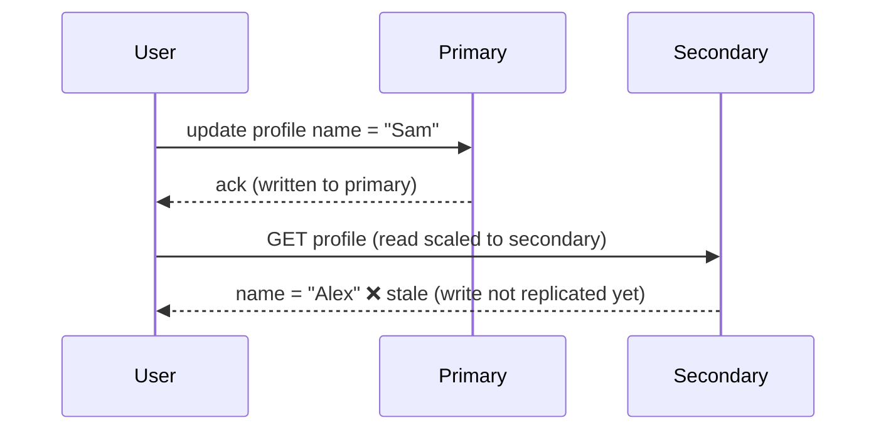
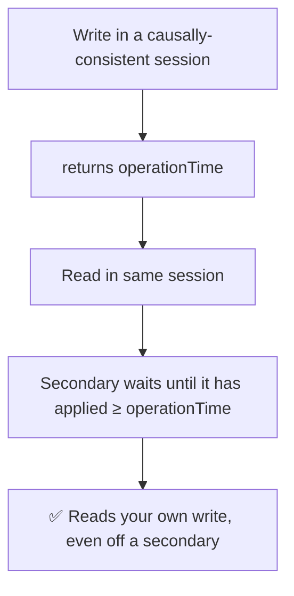

# 32. Mitigate MongoDB Replication Lag

> **In one line:** When you scale reads onto secondaries, they lag the primary — so a user can write then
> immediately read stale data ("read-your-writes" violation). Mitigate with the right **read
> preference**, **write/read concerns**, and routing critical reads to the primary.

> **Original prompt:** Implement strategies to handle instances where a secondary read node falls behind
> the primary write node.

## Overview

A MongoDB replica set has one **primary** (takes writes) and several **secondaries** that asynchronously
replicate the primary's oplog. Routing reads to secondaries scales read throughput — but replication is
**asynchronous**, so a secondary is always a little behind. Under load, network hiccups, or big writes,
that lag grows, and a client reading from a secondary can see **stale** data, including data it *just
wrote*. This problem is about understanding lag and choosing consistency knobs to keep the app correct.

## Functional Requirements

- Scale reads across secondaries without serving unacceptably stale data.
- Guarantee **read-your-own-writes** where the UX demands it (e.g., after saving a profile).
- Detect and react to excessive lag.

## Non-Functional Requirements

| Property | Target |
|---|---|
| Read scalability | Offload eligible reads to secondaries |
| Consistency | Critical reads see fresh/committed data |
| Freshness bound | Alert when lag exceeds a threshold (e.g., > few seconds) |
| Durability | Acknowledged writes survive primary failover |

## How Lag Happens

Secondaries apply the primary's oplog asynchronously; lag spikes from write bursts, slow secondary disks,
network latency, or long-running operations blocking oplog application.

## The Read-Your-Writes Trap

The user "saved" but sees the old value — a confusing correctness bug born purely from reading a lagging
secondary.

## Mitigation Toolbox

**1. Read Preference — route reads deliberately:**

| Read preference | Behavior | Use for |
|---|---|---|
| `primary` (default) | All reads from primary | Strong consistency / read-your-writes |
| `primaryPreferred` | Primary, fall back to secondary | Availability with mostly-fresh reads |
| `secondary` / `secondaryPreferred` | Reads from secondaries | Scale analytics/non-critical reads (tolerate lag) |
| `nearest` | Lowest latency member | Geo latency, lag-tolerant |

Route **critical, just-wrote reads to the primary**; send lag-tolerant reads (reports, feeds) to
secondaries.

**2. Write Concern — how many nodes must ack a write:**

- `w: "majority"` → the write is acknowledged only after a majority of nodes have it, so it **survives
  failover** and won't be rolled back. Trades a bit of latency for durability.

**3. Read Concern — what the read is allowed to see:**

- `readConcern: "majority"` → read only data acknowledged by a majority (won't be rolled back).
- **`readConcern: "linearizable"`** (on primary) → strongest single-document real-time guarantee.

**4. Causal Consistency (the precise fix for read-your-writes on secondaries):**

MongoDB **causally consistent sessions** let a client read its own writes even from secondaries: the write
returns an operationTime/cluster time, and the subsequent read in the same session waits until the
secondary has caught up to that time. This is the surgical answer — scale to secondaries *and* keep
read-your-writes.

## Monitoring & Operational Response

- Track lag via `rs.status()` / `replSetGetStatus` (`optimeDate` difference) and alert past a threshold.
- Under heavy sustained lag: reduce load, check secondary disk/IO, avoid routing latency-sensitive reads
  there until it recovers (`primaryPreferred`).
- Ensure `majority` writes so a failover doesn't roll back "acknowledged" data.

## Scaling & Failure Scenarios

| Scenario | Response |
|---|---|
| Read-heavy analytics | Route to secondaries (`secondaryPreferred`); tolerate lag |
| User must see own write | Primary reads, or causally-consistent session |
| Primary failover | `w: majority` ensures acked writes aren't lost/rolled back |
| Secondary far behind | Alert; stop routing critical reads there; investigate IO/network |
| Global low-latency reads | `nearest` for lag-tolerant data |

## Security

- Consistency choices are also **correctness/trust** choices — financial reads should be primary/majority,
  not stale secondaries.
- Don't leak rolled-back data: `readConcern: majority` avoids showing data that a failover could erase.

## Performance

- Secondaries genuinely scale read throughput — use them for the large volume of lag-tolerant reads.
- `majority`/`linearizable` and causal reads add latency — apply them **selectively** to the reads that
  need them, not globally.
- Keep writes lean so oplog application (and thus lag) stays low.

## Trade-offs & Pitfalls

- **Blindly reading from secondaries** → read-your-writes violations and confusing stale data.
- **All reads on primary** → wastes the read-scaling benefit of the replica set.
- **`w:1` writes** → acknowledged data can be rolled back on failover; use `majority` for critical writes.
- **Ignoring lag monitoring** → silent staleness that surfaces as user-facing bugs.
- **Applying strongest concerns everywhere** → unnecessary latency; scope to critical operations.

## Interview Questions & Answers

- **Why do secondaries serve stale data?** Replication is asynchronous — secondaries apply the primary's
  oplog behind real time, so they can lag.
- **What's the read-your-writes problem?** After a write acked by the primary, a read routed to a lagging
  secondary may not see it yet.
- **How do you fix it while still scaling reads?** Use **causally-consistent sessions** (secondary waits
  to catch up to your write's operationTime), or route just-wrote/critical reads to the primary.
- **What do write/read concerns do?** `w:majority` makes writes failover-safe; `readConcern:majority`/
  `linearizable` control how fresh/committed the data a read sees is.
- **How do you detect lag?** `rs.status()` optime differences; alert past a threshold and reroute critical
  reads.
- **Trade-off of strong consistency knobs?** Higher latency — apply selectively to reads/writes that need
  it.
