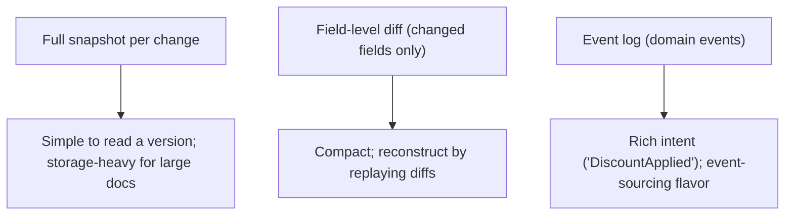
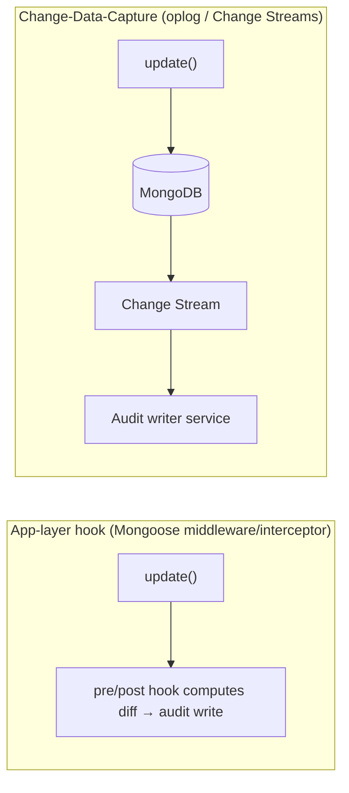
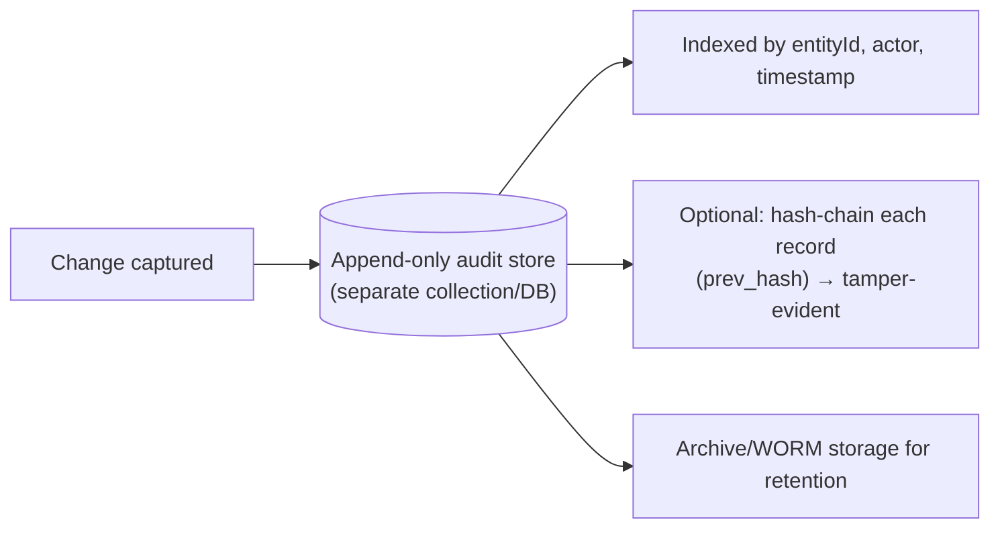

# 33. Design an Audit Trail System

> **In one line:** Capture an immutable, queryable record of *who changed what, when, and how* for
> critical business documents — before/after snapshots or field-level diffs — without slowing the write
> path or letting anyone tamper with the log.

> **Original prompt:** Create a system that captures before-and-after snapshots of critical business
> documents upon every update.

## Overview

Audit trails answer accountability and compliance questions: *who edited this invoice, from what to what,
and when?* Regulations (SOX, HIPAA, GDPR, PCI) often **require** them. The design goals are specific:
capture changes **reliably** (never miss one), store them **immutably** (append-only, tamper-evident),
keep them **queryable** (by entity, actor, time), and do it **without hurting** the transactional write
path. The recurring decision is *how* to capture — snapshots vs diffs vs event log — and *where* to hook
in.

## Functional Requirements

- On create/update/delete of a critical entity, record: actor, timestamp, action, and **before/after**
  state (or a field-level diff).
- Query audit history for an entity ("show all changes to invoice #123") and by actor/time range.
- Immutable: audit records cannot be edited or deleted by application users.
- Reconstruct the state of an entity at any past point (optional but common).

## Non-Functional Requirements

| Property | Target |
|---|---|
| Completeness | Every change captured; no silent gaps |
| Immutability | Append-only; tamper-evident |
| Write impact | Minimal added latency on the business transaction |
| Retention | Long (years) per compliance; efficient storage |
| Queryability | Fast lookups by entity / actor / time |

## What to Capture: Snapshot vs Diff vs Event



| Approach | Stores | Pros | Cons |
|---|---|---|---|
| **Before/after snapshot** | Whole doc pre & post | Trivial to show a version | Bloats for big docs / frequent edits |
| **Field-level diff** | Only changed fields (old→new) | Compact, precise "what changed" | Must replay to reconstruct full state |
| **Event/change log** | Domain events | Captures *intent*, replayable | More modeling; app must emit events |

Most audit systems store a **diff plus actor/timestamp**; keep periodic full snapshots if fast
point-in-time reconstruction matters.

## Where to Hook the Capture



| Method | How | Trade-off |
|---|---|---|
| **App middleware** (Mongoose `pre`/`post` save) | Compute diff in the write path, write an audit doc | Easy, in-band; risk: a code path that bypasses the hook misses audits |
| **CDC / Change Streams** | Subscribe to DB change events, write audits out-of-band | Robust (catches all writes), decoupled, no write-path latency; slightly more infra |
| **DB triggers** (relational) | Trigger writes to an audit table | Guaranteed at DB level; harder to maintain |

**CDC/Change Streams** is the most reliable at scale — it can't be bypassed by an app path and doesn't add
latency to the transaction. App middleware is fine for smaller systems if *all* writes go through it.

## Storage & Immutability



- **Append-only, separate store** — audits live apart from operational data; the app has insert-only
  permission (no update/delete). Consider WORM storage / restricted IAM so even admins can't quietly alter
  history.
- **Tamper-evidence:** hash-chain records (each row stores a hash of the previous) so any alteration breaks
  the chain — a lightweight blockchain-like integrity guarantee for high-stakes audits.
- **Indexing:** by `entityId` (history of one doc), `actorId`, and `timestamp` for the common queries.

## Audit Record Shape

```js
{
  _id, entityType: "invoice", entityId: "123",
  action: "update",                 // create | update | delete
  actor: { userId, role, ip },      // WHO (+ context)
  at: ISODate,                      // WHEN
  changes: [                        // WHAT (field-level diff)
    { field: "amount", from: 1000, to: 1200 },
    { field: "status", from: "draft", to: "sent" }
  ],
  requestId: "trace-abc",           // correlate with logs (problem 15)
  prevHash, hash                    // tamper-evidence (optional)
}
```

## Scaling & Failure Scenarios

| Scenario | Response |
|---|---|
| High write volume | CDC writes audits async, off the transaction path; batch to the audit store |
| Audit store must never lose events | Durable change stream + at-least-once with idempotent audit keys |
| Huge history for hot entities | Index by entity + time; archive old audits to cold/WORM storage |
| Large documents | Store diffs, not full snapshots; snapshot periodically |
| Reconstruct past state | Replay diffs from the last snapshot forward |

## Security

- **Immutability is the security property:** insert-only permissions; ideally WORM/retention-locked so
  history can't be rewritten to hide malfeasance.
- Capture actor identity from the **authenticated** context (never client-claimed); include IP/requestId.
- Audit logs themselves contain sensitive data → access-control and encrypt them; consider redaction for
  PII while preserving the change fact.
- Hash-chaining detects tampering even by privileged users.

## Performance

- Prefer out-of-band capture (CDC) so audits don't add latency to business writes.
- Field-level diffs keep records small; index only query dimensions.
- Batch audit inserts; archive cold data to keep the hot audit store lean.

## Trade-offs & Pitfalls

- **App-hook capture with bypassable write paths** → missing audits; CDC is more reliable.
- **Full snapshots of large docs on every edit** → storage blowup; use diffs.
- **Mutable audit store** → worthless for compliance; make it append-only/WORM.
- **Synchronous audit writes in the transaction** → added latency and a failure coupling; capture async.
- **Trusting client-supplied actor** → forged audit trails; derive from the session.

## Interview Questions & Answers

- **What does an audit trail capture?** Who changed what, when, and how — via before/after snapshots or
  field-level diffs, plus actor/time/context.
- **Snapshot vs diff?** Snapshots are simple but bloat for large/frequent edits; diffs are compact and
  reconstruct state by replay — most systems use diffs (+ periodic snapshots).
- **Where do you hook capture?** App middleware (easy, bypassable) or CDC/Change Streams (robust,
  decoupled, no write-path latency) — prefer CDC at scale.
- **How do you guarantee immutability?** Separate append-only store with insert-only permissions, WORM/
  retention locks, and optional hash-chaining for tamper-evidence.
- **How do you avoid slowing business writes?** Capture out-of-band via change streams, batch inserts.
- **How do you reconstruct a past version?** Replay diffs forward from the nearest full snapshot.
