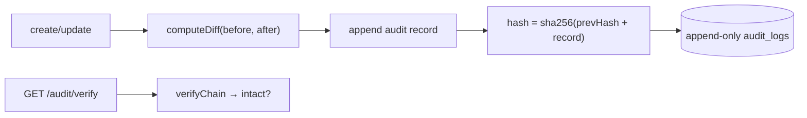

# Audit Trail System — implementation

An immutable audit trail implementing the [design doc](../33-audit-trail-system.md): field-level
**before/after diffs** captured on every change into an **append-only, hash-chained** (tamper-evident)
MongoDB collection.

## Stack

- **Node.js + TypeScript + Express**
- **MongoDB** — entity collection + append-only `audit_logs`

## Architecture



## Endpoints

| Method | Path | Purpose |
| --- | --- | --- |
| POST | `/api/invoices` `{amount, note}` | Create (audited) |
| PUT | `/api/invoices/:id` `{amount, status, note, actor}` | Update → captures diff |
| GET | `/api/invoices/:id/audit` | Change history |
| GET | `/api/audit/verify` | Verify chain integrity (tamper detection) |

## Design-doc mapping

- **What/who/when** → each record stores field-level `changes`, `actor`, and `at`.
- **Diff capture** → `computeDiff` compares before/after (ignoring `_id`/`__v`).
- **Immutability + tamper-evidence** → append-only log with a **hash chain** (`hash = sha256(prevHash +
  record)`); `verifyChain` detects any edit/deletion.
- **Reliability** → in production, capture out-of-band via Change Streams/CDC and store WORM; here it's
  captured inline for a standalone Mongo.

## Run it

```bash
docker compose up --build          # http://localhost:3133
```

```bash
npm install && npm test            # 4 unit tests (diff + hash-chain verify/tamper)
npm run typecheck
```

## Verification

- `npm test` covers field diffs (changed/added), a valid chain verifying, and a tampered record breaking
  it. `npm run typecheck` passes. Full capture + verify run against Mongo under `docker compose up`.
