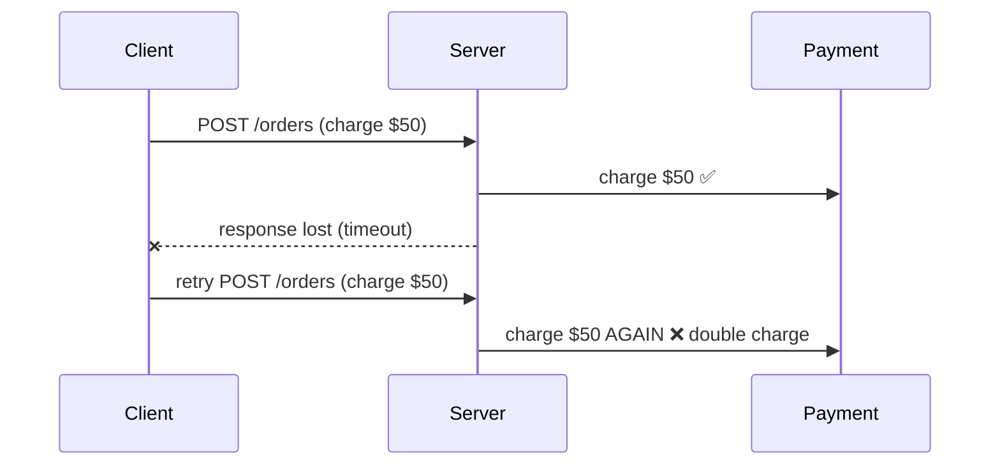
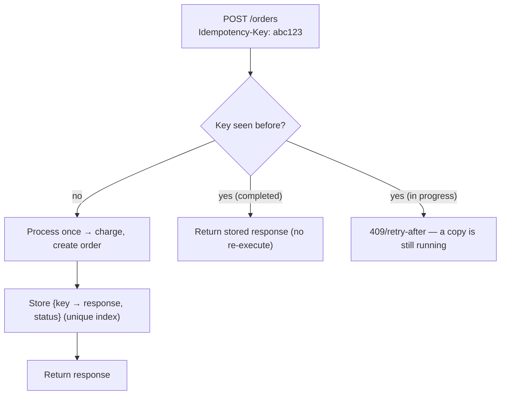
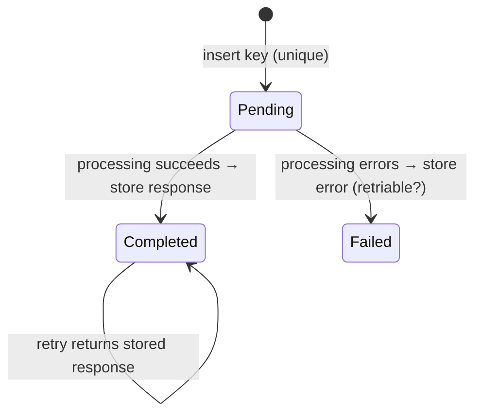

# 34. Idempotent API Endpoints

> **In one line:** Make a payment/order-creation endpoint safe to retry — a client that times out and
> resends must never create two charges/orders — using a client-supplied **Idempotency-Key** stored with
> the first result, so retries return the original response instead of re-executing.

> **Original prompt:** Design a payment or order-creation endpoint that guarantees safe retries if a
> network timeout occurs.

## Overview

Networks lie. A client sends "create order," the server processes it, but the **response** is lost to a
timeout. The client doesn't know if it worked, so it retries — and without protection you've now created
two orders and charged the card twice. **Idempotency** makes a repeated request have the same effect as
one: the operation runs **once**, and every retry returns the **same** result. This is mandatory for money
and any create-with-side-effects endpoint. (GET/PUT/DELETE are naturally idempotent; the hard case is
**POST**.)

## Functional Requirements

- A retried create request produces exactly one resource and one side effect (one charge, one order).
- Retries return the original response (status + body), not a new one or an error.
- Distinguish a genuine retry from a distinct new request.
- Handle concurrent duplicates (two in-flight copies of the same request).

## Non-Functional Requirements

| Property | Target |
|---|---|
| Correctness | Exactly-once effect under retries and concurrency |
| Latency | Minimal overhead (one keyed lookup/insert) |
| TTL | Keys retained long enough to cover realistic retries (e.g., 24h) |
| Safety | No double charge even if the server crashes mid-request |

## The Failure Without Idempotency

The client can't tell "did it work?" from a timeout — so it must retry, and the server must make that safe.

## The Idempotency-Key Pattern

The client generates a **unique key** (UUID) per logical operation and sends it (`Idempotency-Key`
header). The server keys its work on it:

- **First request:** process, then persist `(idempotencyKey → result, status)` under a **unique index**.
- **Retry (same key):** find the stored result → return it verbatim; **do not** re-execute the side effect.
- The whole guarantee rests on that unique key + stored outcome.

## Handling Concurrency & Crashes (the subtle part)

Two copies of the request can arrive **simultaneously** (client fired a retry before the first finished).
Naive "check then insert" races. Fixes:

- **Insert-first with a unique constraint:** attempt to insert the key row *before* processing; the DB's
  unique index lets exactly one insert win. The loser (duplicate-key error) waits for/returns the winner's
  result. This is the same E11000-race technique used in the shopping-app checkout.
- **Status state machine:** the key row has `status: pending → completed`. A second request seeing
  `pending` returns "in progress" (409 / retry-after); seeing `completed` returns the stored response.
- **Crash mid-request:** because the key is inserted first (pending), a retry can detect an abandoned
  `pending` (past a timeout) and either resume or fail safe — never silently double-charge.

## Scope the Key Correctly

- Idempotency is per **(key, endpoint, and often user)** — the same key on a different operation shouldn't
  collide. Optionally **fingerprint the request body**: if the same key arrives with a *different* body,
  reject (`422`) — that's a client bug, not a retry.
- Store the response **and** status code so replays are byte-identical.
- Set a **TTL** (e.g., 24h) — long enough for retries, short enough to bound storage.

## Where This Fits with Payment Providers

Real PSPs (Stripe, etc.) implement exactly this: you pass an idempotency key on charge creation and they
guarantee one charge. Your endpoint should propagate/align its key with the provider's so the *entire*
chain is idempotent, not just your DB row.

## Scaling & Failure Scenarios

| Scenario | Response |
|---|---|
| Client timeout + retry | Same key → stored response replayed; one effect |
| Concurrent duplicate requests | Insert-first unique index; one wins, others return its result / 409 |
| Server crash mid-processing | `pending` row lets a retry detect and resume/fail safe |
| Key store scaling | Redis/DB keyed by idempotency key; TTL eviction |
| Different body, same key | Reject (422) — misuse, not a legitimate retry |

## Security

- Derive the user from the session and scope keys per user so one client can't replay another's key.
- Validate that the replayed response doesn't leak across users (key namespacing).
- Rate-limit to prevent key-space probing/abuse.

## Performance

- One extra keyed lookup/insert per request — negligible; use Redis or a unique-indexed table.
- Insert-first is a single atomic op that doubles as the concurrency guard.
- TTL keeps the key store small.

## Trade-offs & Pitfalls

- **No idempotency on money/create endpoints** → double charges/orders on inevitable retries.
- **Check-then-insert** (non-atomic) → concurrent duplicates both process; use a unique constraint /
  insert-first.
- **Storing only "seen," not the response** → retries get an error/ambiguous result instead of the original.
- **No TTL** → unbounded key growth; **too-short TTL** → a late retry re-executes.
- **Ignoring body mismatch** → same key reused for a different op silently returns the wrong result.

## Interview Questions & Answers

- **Why do POST endpoints need idempotency?** A lost response forces the client to retry; without
  protection the retry creates a second resource/charge.
- **How does the Idempotency-Key pattern work?** Client sends a unique key; server processes once, stores
  `key → response`; retries with the same key return the stored response without re-executing.
- **How do you handle two simultaneous duplicates?** Insert the key first under a unique index — one insert
  wins and processes; the loser returns the winner's result (or 409 while pending).
- **What if the server crashes mid-request?** The `pending` key row lets a retry detect the incomplete
  op and resume/fail safe rather than double-charge.
- **What do you store?** The response body **and** status code (byte-identical replay), with a TTL.
- **How do payment providers help?** They accept an idempotency key and guarantee one charge — align your
  key with theirs for end-to-end safety.
