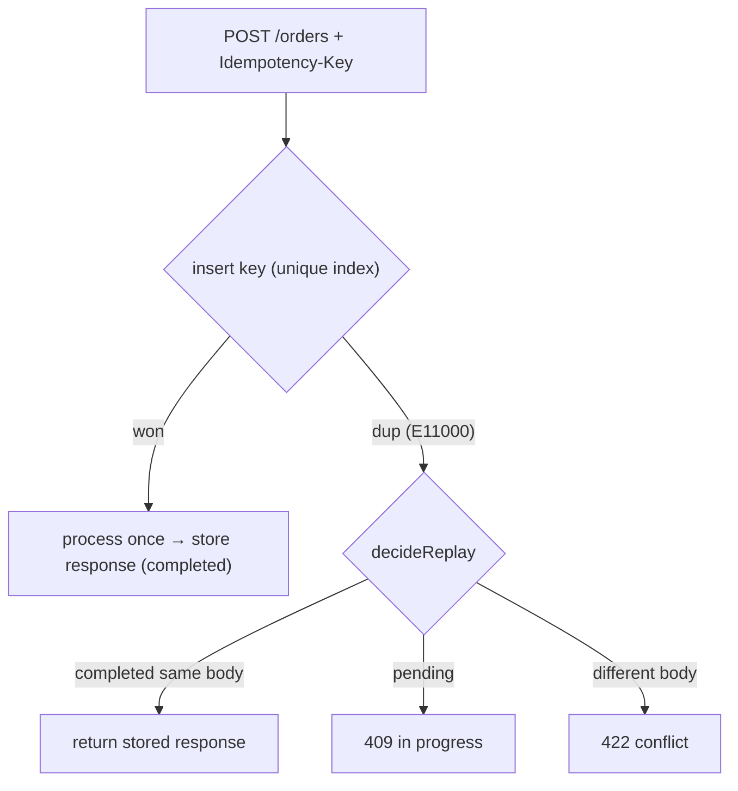

# Idempotent API Endpoints — implementation

Safe-to-retry POST endpoints implementing the [design doc](../34-idempotent-api-endpoints.md): an
**Idempotency-Key** with insert-first on a unique index, **stored-response replay**, body-fingerprint
**conflict** detection, and **in-progress** handling.

## Stack

- **Node.js + TypeScript + Express**
- **MongoDB** — orders + a unique-indexed `idempotency_keys` collection (TTL retention)

## Flow



## Endpoint

| Method | Path | Purpose |
| --- | --- | --- |
| POST | `/api/orders` (`Idempotency-Key` header) | Create an order exactly once across retries |

## Design-doc mapping

- **Exactly-once effect** → insert the key first under a unique index; only one concurrent caller wins
  and does the work.
- **Replay** → completed key returns the **stored** response + status (byte-identical).
- **Concurrency/crash** → a `pending` key means a copy is running (409); insert-first + status avoids
  double-processing.
- **Misuse detection** → same key + different body fingerprint → 422.
- **Retention** → TTL index expires keys after `KEY_TTL_S`.

## Run it

```bash
docker compose up --build          # http://localhost:3134
curl -XPOST localhost:3134/api/orders -H 'content-type: application/json' -H 'Idempotency-Key: k1' -d '{"item":"book","qty":1}'
# repeat the same call → same order, idempotentReplay: true
```

```bash
npm install && npm test            # 4 unit tests (fingerprint + replay decision)
npm run typecheck
```

## Verification

- `npm test` covers fingerprint stability and the replay/in-progress/conflict decision. `npm run
  typecheck` passes. Insert-first + replay run against Mongo under `docker compose up`.
