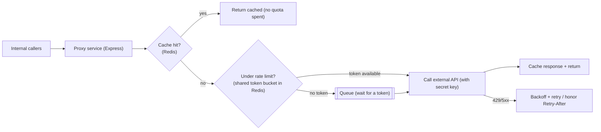
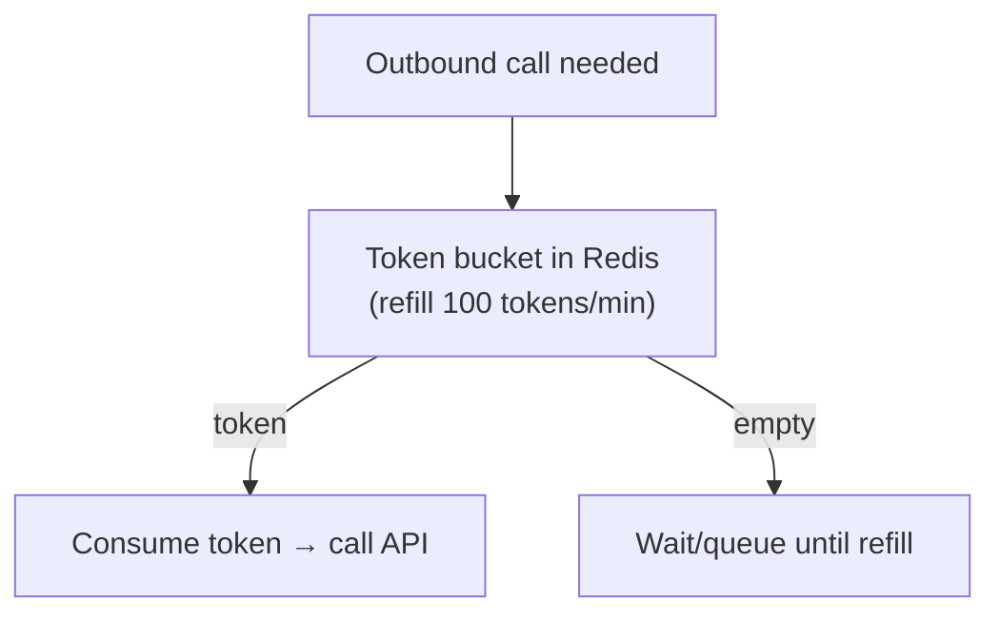
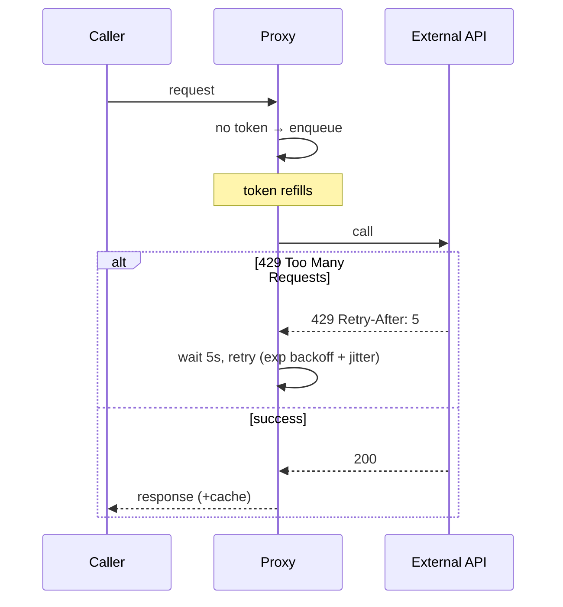

# 35. Rate-Limited Third-Party Proxy

> **In one line:** Front a restrictive external API (e.g. 100 req/min) with your own proxy service that
> throttles, queues, caches, and retries on your behalf — so many internal callers share the external
> quota without ever tripping its rate limit or leaking your API key.

> **Original prompt:** Create an Express service that interfaces with a restrictive external API without
> exceeding its rate limits.

## Overview

You depend on a third-party API with a hard quota (say 100 calls/minute) and a secret key. If every
internal service calls it directly, you get three problems: you **exceed the quota** (429s, bans), you
**scatter the secret key**, and you have **no shared caching or retry policy**. The fix is a **proxy /
gateway service**: a single chokepoint that owns the credential, enforces a **client-side rate limiter**
matched to the provider's quota, **caches** responses, and **queues** overflow instead of dropping it.

## Functional Requirements

- Forward internal requests to the external API, staying under its rate limit.
- Share the external quota across all internal callers.
- Cache responses to avoid spending quota on repeat calls.
- Queue/throttle bursts; retry transient failures and honor `Retry-After`.
- Hide the external API key from internal callers.

## Non-Functional Requirements

| Property | Target |
|---|---|
| Compliance | Never exceed the provider's documented rate limit |
| Throughput | Maximize useful calls within the quota (don't waste it) |
| Latency | Cache hits instant; queued calls bounded wait |
| Resilience | Handle 429/5xx with backoff; degrade gracefully |

## Architecture

The proxy is the **single owner** of the external quota and credential; internal callers just ask the
proxy.

## The Rate Limiter (client-side, matched to provider quota)

Since limits are shared across many proxy instances, the counter must be **centralized in Redis**, not
per-process:

- **Token bucket** (or leaky bucket): refill tokens at the provider's rate (100/min); each outbound call
  consumes one; when empty, callers **wait** (queue) rather than blast the API. Redis (atomic
  `INCR`/Lua) holds the shared count so all proxy instances respect one global limit.
- **Leaky bucket / queue** smooths bursts into a steady outflow at exactly the allowed rate — ideal when
  you must never spike.
- Track the provider's own limit headers (`X-RateLimit-Remaining`, `Retry-After`) and adapt dynamically.

## Caching to Conserve Quota

The cheapest external call is the one you don't make:

- Cache responses in Redis keyed by request params, with a TTL appropriate to data freshness (problem 26).
- **Single-flight / request coalescing:** if 50 callers ask for the same uncached resource at once, make
  **one** external call and share the result — don't spend 50 tokens on identical requests.
- Cache-hit reads never touch the quota at all — often the biggest win.

## Queuing, Backoff & Retries

- Overflow **queues** with a bounded size; apply backpressure (or 503 to callers) if the backlog grows too
  large — never an unbounded queue.
- On 429/5xx: **exponential backoff with jitter**, honor `Retry-After`; cap attempts, then fail/dead-letter.
- Set client timeouts and a **circuit breaker** (problem 20) so a broken provider doesn't hang your proxy.

## Scaling & Failure Scenarios

| Scenario | Response |
|---|---|
| Many proxy instances | Shared Redis token bucket → one global limit, not N×limit |
| Burst of identical requests | Single-flight coalescing + cache → one external call |
| Provider returns 429 | Backoff + `Retry-After`; slow the bucket refill |
| Provider outage | Circuit breaker → fail fast / serve stale cache |
| Queue overflow | Bound the queue; shed load (503) rather than OOM |
| Per-caller fairness | Per-client sub-quotas so one caller can't starve others |

## Security

- The external **API key lives only in the proxy** — internal callers never see it (secret centralization).
- AuthN/Z internal callers to the proxy; per-client quotas prevent one team exhausting the shared limit.
- Log/audit usage per caller for cost attribution and abuse detection; never log the secret.

## Performance

- Cache + single-flight maximize useful work per token; most repeat traffic never hits the provider.
- Redis token bucket is O(1) and shared; queueing smooths bursts to the exact allowed rate.
- Reuse upstream connections (keep-alive) to the provider.

## Trade-offs & Pitfalls

- **Per-instance rate limiting** → N instances × limit = quota blown; centralize the counter in Redis.
- **No caching/coalescing** → wasting quota on duplicate calls.
- **Dropping overflow instead of queuing** → lost work; queue with bounds + backpressure.
- **Ignoring `Retry-After`/429** → escalating bans; honor provider signals.
- **Unbounded queue** → memory blowup; bound and shed.
- **Key in every service** → wide secret exposure; keep it only in the proxy.

## Interview Questions & Answers

- **Why put a proxy in front of the third-party API?** One place owns the quota and secret, adds shared
  caching/retries, and prevents scattered callers from collectively exceeding the limit.
- **How do you enforce the limit across many proxy instances?** A **shared** token/leaky bucket in Redis
  (atomic ops), not per-process counters.
- **How do you avoid wasting quota?** Cache responses (TTL) and **single-flight** identical concurrent
  requests into one external call.
- **What do you do when the provider returns 429?** Exponential backoff with jitter, honor `Retry-After`,
  slow the bucket; circuit-break on sustained failures.
- **How do you handle bursts beyond the rate?** Queue (leaky bucket) to smooth outflow to the allowed rate,
  with a bounded backlog + backpressure.
- **Where does the API key live?** Only in the proxy — internal callers authenticate to the proxy and never
  see the secret.
