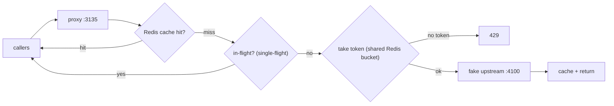

# Rate-Limited Third-Party Proxy — implementation

A proxy that fronts a restrictive external API, implementing the
[design doc](../35-rate-limited-third-party-proxy.md): a **shared Redis token-bucket limiter**, **response
caching**, and **single-flight** coalescing so many callers share the quota without exceeding it. Ships a
bundled fake upstream.

## Stack

- **Node.js + TypeScript + Express**
- **Redis** — atomic (Lua) shared token bucket + response cache

## Architecture



## Endpoints

| Method | Path | Purpose |
| --- | --- | --- |
| GET | `/api/health` | Liveness |
| GET | `/api/proxy/:resource?…` | Fetch via cache → single-flight → rate-limited upstream call |

## Design-doc mapping

- **Shared quota** → an atomic Redis Lua token bucket → one global limit across all proxy instances (not
  per-process).
- **Caching** → responses cached in Redis by a param-ordered key (`source: cache`); cheapest call is none.
- **Single-flight** → concurrent identical requests coalesce to one upstream call (`source: coalesced`).
- **Backpressure** → `429` when the bucket is empty; the key/secret lives only in the proxy.

## Run it

```bash
docker compose up --build          # proxy on http://localhost:3135, fake upstream at :4100
for i in $(seq 1 20); do curl -s localhost:3135/api/proxy/weather; echo; done   # watch cache + 429s
```

```bash
npm install && npm test            # 5 unit tests (token-bucket refill/consume + cache key)
npm run typecheck
```

## Verification

- `npm test` covers token consumption, denial-when-empty, time-based refill, capacity cap, and
  order-independent cache keys. `npm run typecheck` passes. Shared limiting + caching + single-flight run
  against Redis under `docker compose up`.
