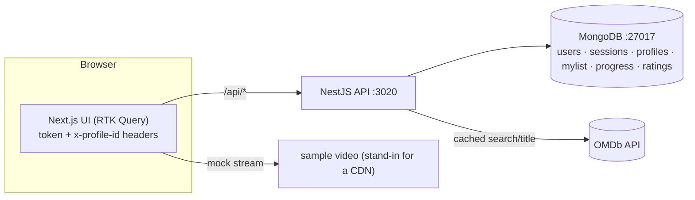

# Netflix Clone — implementation

A runnable, dockerized full-stack Netflix-style app. It implements the **control plane** from the
[system design write-up](../netflix-system-design.md): accounts, profiles, an OMDb-backed catalog you
browse and search, title details, **My List**, **Continue Watching**, and ratings — with a **mock
player** (OMDb serves metadata, not video, which is exactly the design's control-plane / data-plane split).

- **`server/`** — NestJS + MongoDB (Mongoose) API: JWT auth (rotating, revocable refresh tokens),
  profiles, OMDb client with a TTL cache, My List, watch progress, ratings.
- **`web/`** — Next.js 14 (App Router) + Redux Toolkit **RTK Query** UI: login, profile gate, billboard +
  rows, search, title modal, My List, and the player.

## Architecture



## Quick start (Docker)

You need Docker + Docker Compose. From this folder:

```bash
cp .env.example .env
#   → edit .env and set OMDB_API_KEY (free: https://www.omdbapi.com/apikey.aspx)
docker compose up --build
```

- Web: **http://localhost:3000**  ·  API: **http://localhost:3020/api/health**  ·  Mongo: `:27017`
- Register an account → create a profile → browse. Without an `OMDB_API_KEY` the app still runs
  (auth/profiles/My List work); browse/search just come back empty with a hint.

Stop with `Ctrl-C`; `docker compose down -v` also removes the Mongo volume.

## Local dev (without Docker)

> npm is under nvm here; if `npm` is missing: `export PATH="/root/.nvm/versions/node/v22.23.2/bin:$PATH"`.
> You need a local MongoDB at `mongodb://127.0.0.1:27017` (or set `MONGODB_URI`).

```bash
# API
cd server && cp .env.example .env   # set OMDB_API_KEY
npm install && npm run start:dev     # http://localhost:3020

# Web (new terminal)
cd web && cp .env.example .env.local
npm install && npm run dev           # http://localhost:3000
```

## Environment

| Var | Where | Default | Purpose |
| --- | --- | --- | --- |
| `OMDB_API_KEY` | server | *(empty)* | **Secret.** OMDb key for the catalog — never shipped to the client. |
| `MONGODB_URI` | server | `mongodb://127.0.0.1:27017/netflix` | Mongo connection (compose sets it to the `mongo` service). |
| `JWT_ACCESS_SECRET` | server | `change-me-…` | Signs access tokens — change in production. |
| `ACCESS_TTL_S` / `REFRESH_TTL_S` | server | `900` / `2592000` | Access / refresh token lifetimes. |
| `CATALOG_CACHE_TTL_MS` | server | `3600000` | TTL for the in-process OMDb cache. |
| `MAX_PROFILES` | server | `5` | Profiles per account. |
| `CORS_ORIGIN` | server | `http://localhost:3000` | Allowed web origin. |
| `NEXT_PUBLIC_API_BASE_URL` | web (build arg) | `http://localhost:3020` | Where the browser reaches the API (inlined at build). |

## API surface (all under `/api`)

| Method | Path | Auth | Purpose |
| --- | --- | --- | --- |
| POST | `/auth/register` · `/auth/login` | — | Create/sign in → `{ accessToken, refreshToken, user }` |
| POST | `/auth/refresh` · `/auth/logout` | — | Rotate / revoke refresh token |
| GET | `/auth/me` | Bearer | Current user |
| GET/POST/DELETE | `/profiles` | Bearer | List / create (≤5) / delete profiles |
| GET | `/catalog/browse` · `/catalog/search?q=` · `/catalog/title/:imdbID` | Bearer | OMDb-backed (cached) |
| GET/POST/DELETE | `/mylist` | Bearer + `x-profile-id` | Per-profile watchlist |
| PUT/GET | `/history` · `/history/continue` | Bearer + `x-profile-id` | Save progress / resume row |
| GET/PUT/DELETE | `/ratings` | Bearer + `x-profile-id` | Thumbs up/down |
| GET | `/health` | — | Liveness probe |

## How it maps to the design

| Design point | In the code |
| --- | --- |
| Control-plane / data-plane split | Metadata API (OMDb) vs a **mock player** — no video through the API |
| Catalog caching | `server/src/catalog/omdb.service.ts` (cache-aside, TTL) |
| Rotating, revocable refresh tokens + reuse detection | `server/src/auth/*` (`sessions` collection, token family) |
| Per-profile personalization keyed on `(profileId, imdbID)` | `mylist` / `history` / `ratings` unique indexes |
| Secrets via env | `OMDB_API_KEY` only on the server, never in the client bundle |
| Stateless access-token verify + refresh-on-401 | `server/src/common/tokens.ts` + `web/src/store/api.ts` |

## Notes

- **Playback is mocked** (a sample video) because OMDb has no streams — this is intentional and matches
  the write-up: the control plane returns metadata; a real deployment returns a manifest and streams
  adaptive segments from a CDN.
- **Verification:** the server passes `tsc --noEmit` + `nest build`; core auth/crypto/OMDb logic is unit-
  tested; the MongoDB-backed flows run live under `docker compose up`.
