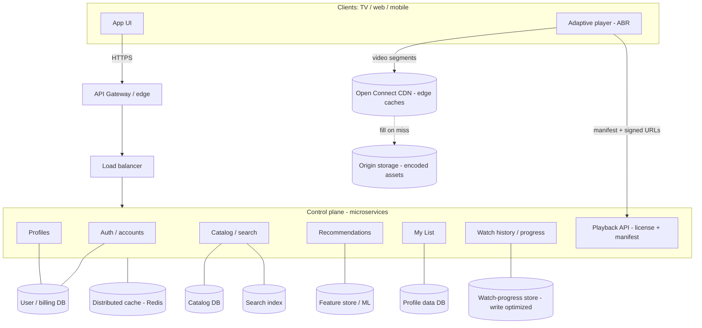
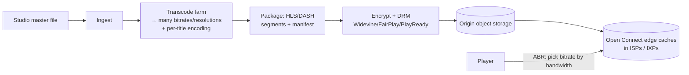
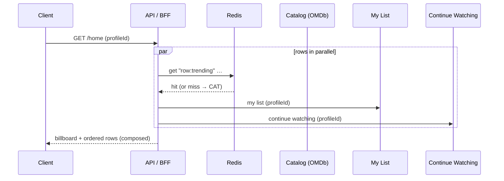

# Design Netflix — System Design

> **In one line:** Design a global, on-demand video streaming service — sign-up and billing, multiple
> profiles per account, a personalized catalog you browse and search, adaptive video playback delivered
> from the edge, "Continue Watching" and "My List" that follow you across devices, and recommendations —
> engineered for hundreds of millions of concurrent viewers with sub-second start times.

> **This repo's implementation:** a runnable, dockerized full-stack clone in
> [`./netflix-implementation`](./netflix-implementation) — **NestJS + MongoDB** API and a **Next.js +
> Redux Toolkit** Netflix-style UI. Because we can't (and shouldn't) host real film catalogs, movie
> **metadata comes from the [OMDb API](https://www.omdbapi.com/)** and playback is a **mock player**
> (a sample stream); everything else — auth, profiles, browse rows, search, title details, My List,
> Continue Watching, ratings — is real.

## Table of contents

1. [Overview & scope](#overview--scope)
2. [Functional requirements](#functional-requirements)
3. [Non-functional requirements](#non-functional-requirements)
4. [Back-of-the-envelope estimates](#back-of-the-envelope-estimates)
5. [High-Level Design (HLD)](#high-level-design-hld)
6. [The video pipeline (upload → encode → CDN → play)](#the-video-pipeline-upload--encode--cdn--play)
7. [Low-Level Design (LLD)](#low-level-design-lld)
8. [Scaling](#scaling)
9. [Performance](#performance)
10. [Security](#security)
11. [Interview discussion](#interview-discussion)
12. [What this repo implements](#what-this-repo-implements)

## Overview & scope

Netflix is, at heart, three very different systems wearing one logo:

- **A control plane** (the "API" / app): accounts, billing, profiles, the catalog you browse, search,
  My List, ratings, watch history, and recommendations. Read-heavy, latency-sensitive, globally
  replicated. This is what our implementation models.
- **A data/streaming plane**: the actual bytes of video, encoded into many bitrates and delivered from
  caches physically close to the viewer (Netflix's **Open Connect** CDN). This is ~90%+ of the traffic
  and is deliberately kept *off* the API path.
- **An offline/analytics plane**: ingestion + encoding pipelines, the recommendation/ML training, A/B
  experimentation, and the data lake.

The interview-worthy insight is the **separation of the control plane from the data plane**: a "play"
click is a tiny API call that returns a **manifest + signed CDN URLs**; the multi-gigabyte stream never
touches your application servers.

## Functional requirements

1. **Accounts & billing** — sign up, log in, manage a subscription plan, payment (out of scope to build,
   in scope to design).
2. **Profiles** — up to ~5 profiles per account (with a "kids" mode); switching profiles swaps the whole
   personalized experience.
3. **Browse** — a home page of horizontally-scrolling **rows** (Trending, genres, "Because you watched…"),
   each a ranked list of titles, plus a featured **billboard**.
4. **Search** — title / person / genre search with fast autocomplete.
5. **Title details** — synopsis, cast, rating, similar titles.
6. **Playback** — start/resume a title with **adaptive bitrate** streaming; save progress.
7. **Continue Watching** — resume any title on any device at the exact position.
8. **My List** — add/remove titles to a personal watchlist.
9. **Ratings** — thumbs up/down feeding recommendations.
10. **Recommendations** — personalized ranking of rows and titles.

## Non-functional requirements

| Attribute | Target / approach |
|---|---|
| **Availability** | ~99.99% for the control plane; playback degrades gracefully (lower bitrate, cached rows) |
| **Latency** | Home/browse p99 < ~300 ms (heavily cached); **video start (TTFF) < ~1 s** via edge caches |
| **Scale** | 100s of millions of subscribers; tens of millions concurrent streams at peak |
| **Read-heavy** | Browse/playback reads ≫ writes → cache aggressively, replicate reads |
| **Consistency** | Eventual for catalog/recommendations; stronger for billing/entitlements |
| **Global** | Multi-region, active-active; content + APIs served near the user |
| **Durability** | User data (profiles, history, lists) never lost; video assets replicated across the CDN |
| **Resilience** | Fault isolation, graceful degradation, chaos-tested (Netflix's "Chaos Monkey" heritage) |

## Back-of-the-envelope estimates

```text
Subscribers:            ~250M          Profiles:      ~250M × 2 ≈ 500M
Peak concurrent streams: ~10M
Avg bitrate:            ~5 Mbps (HD)   →  10M × 5 Mbps = 50 Tbps of egress at peak
  ⇒ this MUST be served from a CDN at the edge, never from origin/app servers.
Browse/API RPS:         reads dominate; a single "home" load fans out to many rows
Catalog size:           ~10k–100k titles (small!) → fits in cache; the VIDEO is the big data
Watch-progress writes:  heartbeats every ~10–30s per active stream → 10M/30s ≈ 300k writes/s
  ⇒ progress is high-write; batch/debounce it, store in a write-optimized store.
```

Two takeaways: **the catalog metadata is tiny and cacheable**, while **the video is enormous and belongs
on a CDN**, and **watch-progress is a firehose of small writes** that needs its own write-optimized path.

## High-Level Design (HLD)



Key ideas:

- **API Gateway / BFF** terminates TLS, authenticates, rate-limits, and fans a single "home" request out
  to catalog + recommendations + My List + continue-watching (or a **GraphQL/BFF** composes them).
- **Microservices** by bounded context (auth, profiles, catalog, recommendations, playback, history) so
  teams and scaling are independent.
- **Playback is a two-step**: the app calls the **Playback API** to get a **manifest** (list of bitrate
  renditions) + **signed, expiring CDN URLs** (+ a DRM license); the player then pulls **segments
  directly from the CDN**. The heavy bytes bypass the services entirely.
- **Caching everywhere** — the catalog and rendered rows are cached in Redis and at the edge; the video
  is cached in ISP-embedded CDN nodes.

Related repo concepts: [CDN](../../01-core-infrastructure-concepts/07-cdn.md),
[API Gateway](../../01-core-infrastructure-concepts/09-api-gateway.md),
[Load Balancer](../../01-core-infrastructure-concepts/04-load-balancer.md),
[Cache](../../02-data-and-storage-concepts/08-cache.md),
[Sharding](../../02-data-and-storage-concepts/06-sharding.md),
[Replication](../../02-data-and-storage-concepts/07-replication.md).

## The video pipeline (upload → encode → CDN → play)

Even though our implementation mocks playback, the design must cover the real thing:



- **Adaptive Bitrate (ABR)**: each title is encoded into a ladder of renditions (e.g. 240p→4K). The
  **client** measures bandwidth/buffer and switches renditions per segment for smooth playback — this is
  why start is fast and quality adapts instead of buffering.
- **Per-title / per-scene encoding**: optimize bitrate for each title's complexity to save bandwidth.
- **DRM**: content is encrypted; the player gets a **license** from a license server keyed to the device.
- **Open Connect**: Netflix ships appliances into ISPs so segments come from within the viewer's network
  — the reason 50 Tbps is even possible.

## Low-Level Design (LLD)

### Data model (control plane)

```text
User        { _id, email (unique), passwordHash, plan, createdAt }
Session     { _id, userId, refreshTokenHash, familyId, revoked, expiresAt }   // refresh rotation
Profile     { _id, userId, name, avatar, isKids, createdAt }                   // ≤5 per user
Title       { imdbID, title, year, type, poster, genre, plot, ... }            // here: OMDb-sourced
MyListItem  { _id, profileId, imdbID, title, poster, addedAt }   idx(profileId, imdbID) unique
Progress    { _id, profileId, imdbID, positionS, durationS, updatedAt }  idx(profileId,imdbID) unique
Rating      { _id, profileId, imdbID, value: 'up'|'down', updatedAt }    idx(profileId,imdbID) unique
```

- **My List / Progress / Rating** are all **per profile** (not per account) and keyed uniquely on
  `(profileId, imdbID)` so writes are **idempotent upserts**.
- **Progress** is the hot write path: the player heartbeats a position; we **upsert** the latest, and
  "Continue Watching" is a query of recent, unfinished progress rows.

### Catalog & browse (OMDb-backed here)

Real Netflix owns its catalog DB + a search index (Elasticsearch) + a recommendation ranker. Here the
catalog is **OMDb**:

- **Browse rows** = a set of curated search queries (e.g. "Marvel", "Batman", "Star Wars"), each mapped
  to a row; every OMDb search returns ~10 titles with posters. The **billboard** is a featured title.
- **Search** proxies OMDb `?s=<query>`.
- **Title details** proxies OMDb `?i=<imdbID>` (plot, cast, rating, runtime…).
- An **in-process TTL cache** wraps every OMDb call — the catalog is small and rarely changes, so caching
  turns most browse loads into zero upstream calls and shields us from OMDb's rate limits (this is the
  [cache-aside](../../02-data-and-storage-concepts/09-cache-aside.md) pattern). In production this cache
  is Redis, shared across instances, plus edge caching of whole rows.

### Auth & sessions

- **Access token**: short-lived, signed (HMAC/JWT), verified **statelessly** on every request — no DB hit.
- **Refresh token**: long-lived, stored **hashed** server-side (Session collection) so it's **revocable**;
  **rotated** on every refresh with reuse detection (see
  [token refresh](../../06-basic-level-system-design-problems/25-token-refresh-mechanism/25-token-refresh-mechanism.md)).
- **Passwords**: hashed with a slow KDF (scrypt/argon2/bcrypt) + per-user salt.
- **Profile context**: requests carry the selected `profileId`; the server verifies it belongs to the
  authenticated user before touching per-profile data.

### The "home" fan-out (BFF)



One client call → parallel fan-out → a composed payload. Rows are cached; personalized rows
(My List, Continue Watching) are cheap per-profile queries.

### Service contracts (this implementation)

```text
POST /auth/register {email,password}         → tokens
POST /auth/login    {email,password}         → { accessToken, refreshToken, user }
POST /auth/refresh  {refreshToken}           → rotated tokens
POST /auth/logout   {refreshToken}
GET  /profiles                               → list (≤5)   · POST /profiles · DELETE /profiles/:id
GET  /catalog/browse                         → billboard + rows (cached OMDb)
GET  /catalog/search?q=                      → results (cached OMDb)
GET  /catalog/title/:imdbID                  → details (cached OMDb)
GET/POST/DELETE /mylist        (x-profile-id)→ per-profile watchlist
GET  /history/continue         (x-profile-id)→ resume rows ; PUT /history {imdbID,positionS,durationS}
GET/PUT /ratings               (x-profile-id)→ thumbs up/down
```

## Scaling

- **Serve video from the edge (CDN), not origin.** The single most important decision — otherwise egress
  and cost are impossible. Signed, expiring URLs; ISP-embedded caches; ABR to fit each connection.
- **Cache the catalog aggressively.** It's small and read-mostly: Redis + edge caching of composed rows;
  invalidate on catalog changes. Near-100% hit ratio for browse.
- **Read replicas + regional replication** for user data; route reads to the nearest replica. Accept
  **eventual consistency** for lists/history (a My List add can propagate in a second).
- **Shard the write-heavy stores.** Watch-progress is partitioned by `profileId` (or userId); it's a
  firehose, so use a write-optimized store (e.g. Cassandra/DynamoDB) and **debounce heartbeats**
  client-side (send every ~10–30s, or on pause/seek) rather than per second.
- **Stateless services behind load balancers** → scale horizontally; autoscale on RPS/CPU.
- **Async everything non-critical** — ratings/impressions/telemetry go onto a queue/stream (Kafka) and
  are processed offline for recommendations, not on the request path.
- **Multi-region active-active** for availability and latency; failover a region without downtime.

## Performance

- **TTFF (time to first frame) < ~1 s**: pre-warmed edge caches, fast manifest endpoint, ABR starting at
  a low rendition then ramping up.
- **Browse feels instant**: cached rows, prefetch the next rows as you scroll, optimistic My List toggles,
  image CDN with responsive poster sizes, lazy-loaded rows.
- **Debounced progress writes** keep the write path sane; the client owns the playback position and syncs
  periodically.
- **Per-title encoding** shrinks bitrate for the same quality → less bandwidth, faster starts.
- **Connection reuse / HTTP2/3**, gzip/brotli on API responses, and pagination/limits on every list.
- **Single-flight + TTL jitter** on the catalog cache to avoid stampedes when a hot row expires
  (see [caching](../../06-basic-level-system-design-problems/10-caching-layer/10-caching-layer.md)).

## Security

- **AuthN**: short-lived signed access tokens (stateless verify) + **rotating, revocable** refresh tokens
  stored hashed; reuse detection revokes the session family. Passwords via a slow KDF + salt.
- **AuthZ / tenancy**: every per-profile request re-checks that the profile belongs to the caller; kids
  profiles are content-filtered server-side (never trust the client).
- **Transport**: HTTPS/TLS everywhere; HSTS; secure, `httpOnly`, `SameSite` cookies for refresh tokens in
  a browser (guards against XSS token theft) + CSRF defense.
- **Content protection (DRM)**: video is encrypted; per-device licenses via Widevine/FairPlay/PlayReady;
  **signed, short-TTL CDN URLs** so a leaked link expires; watermarking / concurrency limits to deter
  account/stream sharing and piracy.
- **Input validation** (Zod) on every endpoint; output-encode anything rendered.
- **Rate limiting & bot defense** at the gateway (login, search, signup); WAF; secrets in a manager
  (the **OMDb API key lives only in env / a secret store**, never in the client bundle or the repo).
- **PII & compliance**: encrypt sensitive data at rest, least-privilege access, audit logs, GDPR/CCPA
  data-export/delete, PCI-DSS handled by a payment processor (never store raw card data).

## Interview discussion

> **I** = Interviewer, **C** = Candidate.

**I:** Design Netflix. Where do you start?

**C:** I scope it into a **control plane** (accounts, profiles, catalog, browse, search, My List, history,
recommendations — read-heavy, latency-sensitive API) and a **data plane** (the actual video bytes). The
first and biggest decision is to **separate them**: a "play" click is a small API call returning a
manifest + signed CDN URLs; the multi-gigabyte stream is served from a **CDN at the edge**, never from my
app servers. That one decision is what makes the bandwidth (tens of Tbps at peak) and latency feasible.

**I:** Walk me through what happens when I press play.

**C:** The player calls the **Playback API** with the title + device. The service checks entitlement,
picks the right **encoding ladder**, returns a **manifest** (available bitrates) plus **signed,
short-lived CDN URLs** and a **DRM license**. The player then does **ABR**: it starts at a low bitrate for
a fast first frame and adapts per segment based on measured bandwidth and buffer level, pulling segments
straight from the nearest **Open Connect** cache. My services never see the video bytes.

**I:** How do you build the home page fast?

**C:** The home page is **rows**. Most rows (Trending, genres) are the **same for many users** and are
**cached** (Redis + edge) — near-100% hit ratio because the catalog is tiny and changes slowly.
Personalized rows (My List, Continue Watching, "Because you watched…") are cheap per-profile lookups or
precomputed by the rec system. A **BFF** composes them with a parallel fan-out into one payload, and the
client lazy-loads rows as you scroll. In this repo, the rows come from cached **OMDb** searches.

**I:** "Continue Watching" — how does progress sync?

**C:** The player emits **heartbeats** with the current position, but I **debounce** them (every
~10–30s, and on pause/seek) — at 10M concurrent streams, per-second writes would be ~10M writes/s. I
**upsert** `(profileId, imdbID) → position` into a **write-optimized, sharded** store; Continue Watching
is a query of recent unfinished rows. Progress is eventually consistent across devices, which is fine.

**I:** Profiles vs accounts?

**C:** Billing and login are per **account**; the *experience* (recommendations, My List, history,
ratings, maturity filter) is per **profile**. So those tables key on `profileId`, and every request
carries the selected profile, which the server authorizes against the account.

**I:** How do recommendations fit in without slowing requests?

**C:** Recommendations are **precomputed offline**. Impressions, plays, ratings, and search stream into
Kafka → a data lake → ML training → a **feature/ranking store**. At request time I just **read** a
ranked list; I never train or do heavy compute on the hot path. Ratings/thumbs are async signals.

**I:** How do you keep it available globally?

**C:** **Multi-region active-active** for the control plane with regional read replicas; **CDN** for
video; **graceful degradation** — if recommendations are down, serve generic rows from cache; if a region
fails, route to another. Netflix famously runs **chaos engineering** to prove the system survives
instance/region loss.

**I:** Biggest bottleneck / hardest part?

**C:** Bandwidth and **encoding/CDN economics** on the data plane, and **write volume** (progress +
telemetry) plus **recommendation freshness** on the control plane. The mitigations are per-title
encoding + Open Connect for video, debounced/sharded writes for progress, and offline precomputation +
caching for recommendations and browse.

**I:** How would you protect the content?

**C:** DRM (encrypted segments + per-device licenses), **signed short-TTL URLs**, concurrency/stream
limits and device registration to deter sharing, and forensic watermarking for leak tracing. None of the
protection lives in the client's trust boundary.

## What this repo implements

The [`./netflix-implementation`](./netflix-implementation) folder is a runnable, **dockerized** slice of
the control plane:

| Concern | In this build |
|---|---|
| Accounts & auth | Register/login, **JWT access + rotating refresh** (revocable sessions), scrypt password hashing |
| Profiles | Create/select/delete, up to 5 per account, kids flag |
| Catalog | **OMDb**-backed browse rows + billboard, search, and title details, wrapped in a **TTL cache** |
| My List | Per-profile add/remove/list (idempotent upserts) |
| Continue Watching | Per-profile watch **progress** upserts + resume row |
| Ratings | Per-profile thumbs up/down |
| Playback | **Mock player** (sample stream) that reports progress — OMDb has no video, and that's the design point |
| Platform | **NestJS + MongoDB** API, **Next.js + Redux Toolkit** UI, **Docker Compose** (mongo + server + web), full **env** configuration (incl. the OMDb key as a secret) |

Design choices deliberately mirrored from the write-up: control-plane/data-plane split (metadata API vs a
separate player), aggressive **catalog caching**, **per-profile** personalization keyed on
`(profileId, imdbID)`, and **secrets via env** (the OMDb key never ships to the client). See the
implementation's README for how to run it with a single `docker compose up`.
