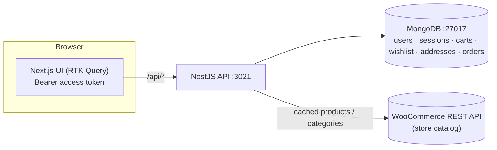

# Shopping App (Amazon-style) — implementation

A runnable, dockerized full-stack e-commerce storefront. It implements the shopper-facing flow from the
[system design write-up](../shopping-app-system-design.md): accounts, a **WooCommerce-backed catalog** you
browse/search/filter/sort, product details, **cart**, **wishlist**, saved **addresses**, an **idempotent
checkout**, and **order history** — with **mocked payment** (WooCommerce serves the product catalog; the
cart/orders live in our own MongoDB, mirroring the design's read-plane / write-plane split).

- **`server/`** — NestJS + MongoDB (Mongoose) API: JWT auth (rotating, revocable refresh tokens),
  a WooCommerce REST client with a TTL cache, cart, wishlist, addresses, and idempotent orders with
  server-authoritative totals.
- **`web/`** — Next.js 14 (App Router) + Redux Toolkit **RTK Query** UI: sign in, catalog with
  search/department filter/sort/pagination, product page, cart, wishlist, address book, checkout, and orders.

## Architecture



## Quick start (Docker)

You need Docker + Docker Compose. From this folder:

```bash
cp .env.example .env
#   → edit .env and set WC_BASE_URL / WC_CONSUMER_KEY / WC_CONSUMER_SECRET (see below)
docker compose up --build
```

- Web: **http://localhost:3000**  ·  API: **http://localhost:3021/api/health**  ·  Mongo: `:27017`
- Create an account → browse products → add to cart → add an address → check out → see the order.
  Without WooCommerce keys the app still runs (auth/cart/wishlist/addresses/checkout work); the product
  listing just comes back empty with a hint.

Stop with `Ctrl-C`; `docker compose down -v` also removes the Mongo volume.

### Getting WooCommerce REST API keys

In a WordPress site with WooCommerce installed: **WooCommerce → Settings → Advanced → REST API →
Add key**. Read permission is enough. Set `WC_BASE_URL` to `https://<your-store>/wp-json/wc/v3` and
paste the `ck_…` / `cs_…` into `WC_CONSUMER_KEY` / `WC_CONSUMER_SECRET`. These stay on the server.

## Local dev (without Docker)

> npm is under nvm here; if `npm` is missing: `export PATH="/root/.nvm/versions/node/v22.23.2/bin:$PATH"`.
> You need a local MongoDB at `mongodb://127.0.0.1:27017` (or set `MONGODB_URI`).

```bash
# API
cd server && cp .env.example .env    # set WC_* keys
npm install && npm run start:dev      # http://localhost:3021

# Web (new terminal)
cd web && cp .env.example .env.local
npm install && npm run dev            # http://localhost:3000
```

## Environment

| Var | Where | Default | Purpose |
| --- | --- | --- | --- |
| `WC_BASE_URL` | server | *(empty)* | WooCommerce REST base, e.g. `https://store/wp-json/wc/v3`. |
| `WC_CONSUMER_KEY` / `WC_CONSUMER_SECRET` | server | *(empty)* | **Secrets.** WooCommerce API keys — never shipped to the client. |
| `WC_CURRENCY` | server | `USD` | Currency code used to format prices. |
| `MONGODB_URI` | server | `mongodb://127.0.0.1:27017/shopping` | Mongo connection (compose sets it to the `mongo` service). |
| `JWT_ACCESS_SECRET` | server | `change-me-…` | Signs access tokens — change in production. |
| `ACCESS_TTL_S` / `REFRESH_TTL_S` | server | `900` / `2592000` | Access / refresh token lifetimes. |
| `CATALOG_CACHE_TTL_MS` | server | `300000` | TTL for the in-process WooCommerce cache. |
| `DEFAULT_PER_PAGE` | server | `12` | Default catalog page size. |
| `CORS_ORIGIN` | server | `http://localhost:3000` | Allowed web origin. |
| `NEXT_PUBLIC_API_BASE_URL` | web (build arg) | `http://localhost:3021` | Where the browser reaches the API (inlined at build). |

## API surface (all under `/api`)

| Method | Path | Auth | Purpose |
| --- | --- | --- | --- |
| POST | `/auth/register` · `/auth/login` | — | Create/sign in → `{ accessToken, refreshToken, user }` |
| POST | `/auth/refresh` · `/auth/logout` | — | Rotate / revoke refresh token |
| GET | `/auth/me` | Bearer | Current user |
| GET | `/catalog/products?page&perPage&search&category&sort` | — | WooCommerce listing (cached) |
| GET | `/catalog/categories` · `/catalog/products/:id` | — | Categories / product detail (cached) |
| GET/POST/PATCH/DELETE | `/cart` · `/cart/items` · `/cart/items/:productId` | Bearer | View / add / set qty / remove / clear |
| GET/POST/DELETE | `/wishlist` · `/wishlist/:productId` | Bearer | List / add / remove |
| GET/POST/DELETE | `/addresses` · `/addresses/:id` | Bearer | Address book |
| POST | `/orders/checkout` | Bearer + `Idempotency-Key` | Place an order from the cart (idempotent) |
| GET | `/orders` · `/orders/:id` | Bearer | Order history / detail |
| GET | `/health` | — | Liveness probe |

## How it maps to the design

| Design point | In the code |
| --- | --- |
| Read-plane / write-plane split | Catalog served from WooCommerce (read) vs cart/orders in our MongoDB (write) |
| Catalog caching | `server/src/catalog/woocommerce.service.ts` (cache-aside, TTL) |
| Rotating, revocable refresh tokens + reuse detection | `server/src/auth/*` (`sessions` collection, token family) |
| Money as integer cents (never floats) | `server/src/common/totals.ts`, `priceToCents` in the Woo client |
| Server-authoritative totals | `computeTotals` recomputed from the live cart at checkout — client totals are never trusted |
| Idempotent checkout | `Idempotency-Key` header + unique index + E11000 race handling in `orders.service.ts` |
| Secrets via env | WooCommerce keys only on the server, never in the client bundle |
| Stateless access-token verify + refresh-on-401 | `server/src/common/tokens.ts` + `web/src/store/api.ts` |

## Notes

- **Payment is mocked** — checkout marks the order `paid` immediately and collects no card details. A
  real deployment would tokenize a card with a PSP (Stripe/Adyen) and only store a token, exactly as the
  write-up describes (PCI scope stays with the processor).
- **Orders are ours, not WooCommerce's** — we read the catalog from WooCommerce but persist carts/orders
  in our own MongoDB, which keeps the write path independent and avoids needing store write-keys.
- **Verification:** the server passes `tsc --noEmit` + `nest build`; the WooCommerce client, tokens,
  password hashing, and totals math are unit-tested; the MongoDB-backed flows run live under
  `docker compose up`.
