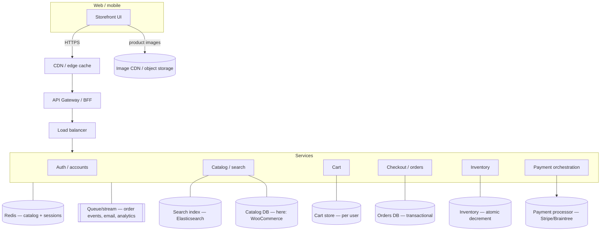
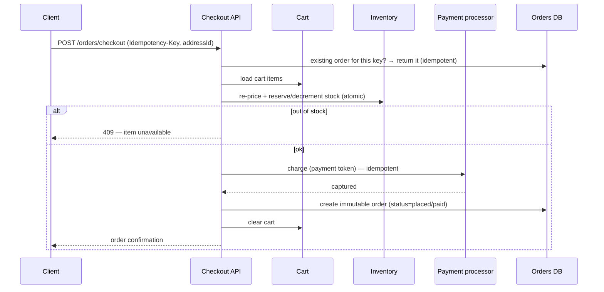

# Design an E-Commerce Website (Amazon-like) — System Design

> **In one line:** Design an online store — a searchable, filterable **product catalog**, a **cart** that
> follows a user across devices, **checkout** with addresses and **payment**, **order** placement and
> tracking, wishlists and reviews — built read-heavy at the front, strongly-consistent at the money, and
> scalable to millions of shoppers and a huge catalog.

> **This repo's implementation:** a runnable, dockerized full-stack clone in
> [`./shopping-app-implementation`](./shopping-app-implementation) — **NestJS + MongoDB** API and a
> **Next.js + Redux Toolkit** storefront. The **product catalog comes from the
> [WooCommerce REST API](https://woocommerce.github.io/woocommerce-rest-api-docs/)** (a real, hostable
> store backend); the **cart, wishlist, addresses, and orders** are our own — so the whole
> browse → cart → checkout → order-history journey is real, with payment mocked at the gateway boundary.

## Table of contents

1. [Overview & scope](#overview--scope)
2. [Functional requirements](#functional-requirements)
3. [Non-functional requirements](#non-functional-requirements)
4. [Back-of-the-envelope estimates](#back-of-the-envelope-estimates)
5. [High-Level Design (HLD)](#high-level-design-hld)
6. [Low-Level Design (LLD)](#low-level-design-lld)
7. [The checkout & order flow](#the-checkout--order-flow)
8. [Scaling](#scaling)
9. [Performance](#performance)
10. [Security](#security)
11. [Interview discussion](#interview-discussion)
12. [What this repo implements](#what-this-repo-implements)

## Overview & scope

An e-commerce site is several subsystems with very different characteristics glued together:

- **Catalog & search** — products, variants, categories, prices, inventory, images, reviews. Enormous and
  **read-heavy** (browsing ≫ buying); wants CDN + search index + aggressive caching. *(Our WooCommerce
  source stands in for this.)*
- **Cart** — a per-user mutable bag of items; high write, must survive across sessions/devices, tolerant
  of eventual consistency, but must re-price and re-check stock at checkout.
- **Checkout, payment & orders** — the **money path**. This is where you flip from "fast and eventually
  consistent" to **transactional and durable**: reserve stock, take payment (via a PCI-compliant
  processor), create an immutable **order**, and never double-charge or oversell.
- **Fulfillment / post-order** — order status, shipping, returns, notifications (out of build scope, in
  design scope).

The interview insight is the **split between the read plane (catalog/browse — cache everything) and the
write/consistency plane (inventory + checkout + payment — get it exactly right)**, plus **idempotency**
so a double-clicked "Place order" doesn't charge twice.

## Functional requirements

1. **Browse** a catalog: list products with **pagination**, **category** filter, **search**, and **sort**
   (price, rating, newest).
2. **Product detail** — images, description, price, rating, stock status, variants.
3. **Cart** — add/update quantity/remove; persists per user across devices; shows a running total.
4. **Wishlist** — save items for later.
5. **Addresses** — manage shipping addresses.
6. **Checkout** — choose address, review server-computed totals (subtotal + shipping + tax), **place an
   order** (payment mocked), which clears the cart.
7. **Orders** — order history and order detail with status.
8. **Auth** — register/login; the cart, wishlist, addresses and orders are all per account.
9. **Reviews/ratings** — display aggregate rating (writing reviews is a stretch goal).

## Non-functional requirements

| Attribute | Target / approach |
|---|---|
| **Availability** | ~99.99% for browse/cart; checkout degrades safely (never double-charge) |
| **Latency** | Catalog/listing p99 < ~300 ms via cache + CDN; product page fast; search snappy |
| **Consistency** | **Eventual** for catalog/cart; **strong/transactional** for inventory + payment + orders |
| **Scale** | Millions of users, large catalog, spiky traffic (sales/Prime Day) → horizontal + cache |
| **Durability** | Orders & payments are immutable and never lost; cart is best-effort but persisted |
| **Idempotency** | "Place order" and payment capture are idempotent (no double orders/charges) |
| **Security/PCI** | Card data never touches our servers — tokenized via a payment processor |
| **Observability** | Track conversion funnel, cart abandonment, checkout errors, inventory drift |

## Back-of-the-envelope estimates

```text
Users:                    ~100M           DAU: ~10M
Browse : buy ratio:       ~100 : 1        → reads dominate massively → cache the catalog
Catalog:                  ~100M SKUs      → needs a search index (Elasticsearch), not SQL LIKE
Peak listing/search RPS:  very high, cacheable → CDN + Redis near-100% hit on hot pages
Orders/day:               ~1M             → ~12/s avg, 100s/s at sale peaks (the strongly-consistent path)
Cart writes:              high, small     → per-user doc; cheap upserts
Product images:           huge egress     → object storage + CDN (never from app servers)
```

Two takeaways: **browsing is a caching/CDN problem** (huge, read-mostly), while **checkout is a
correctness problem** (comparatively low volume, but must be transactional and idempotent).

## High-Level Design (HLD)



Key ideas:

- **Read plane (catalog/search)**: served from a **search index** + **Redis** + **CDN**; images from an
  image CDN. Browsing never hits the transactional DB.
- **Write plane (checkout)**: a **transactional** orders DB, **atomic inventory** decrement, and a
  **payment processor** integration — with **idempotency keys** so retries don't duplicate.
- **BFF/API gateway** authenticates, rate-limits, and composes responses.
- **Async everything non-critical**: order-confirmation emails, analytics, recommendations, search
  reindexing go through a **queue/stream** (Kafka/SQS), not the request path.

Related repo concepts: [CDN](../../01-core-infrastructure-concepts/07-cdn.md),
[API Gateway](../../01-core-infrastructure-concepts/09-api-gateway.md),
[Cache](../../02-data-and-storage-concepts/08-cache.md),
[Index](../../02-data-and-storage-concepts/05-index.md),
[Sharding](../../02-data-and-storage-concepts/06-sharding.md),
[Idempotency](../../03-distributed-systems-concepts/07-idempotency.md),
[Saga Pattern](../../03-distributed-systems-concepts/10-saga-pattern.md).

## Low-Level Design (LLD)

### Data model (our services)

```text
User      { _id, email (unique), passwordHash, createdAt }
Session   { _id, userId, refreshTokenHash, familyId, revoked, expiresAt }   // refresh rotation
Product   { id, name, priceCents, images[], categories[], rating, stock }   // here: WooCommerce-sourced
Cart      { _id, userId (unique), items: [{ productId, name, priceCents, image, qty }], updatedAt }
Wishlist  { _id, userId, productId, name, priceCents, image }   idx(userId, productId) unique
Address   { _id, userId, name, line1, city, state, zip, country, phone }
Order     { _id, userId, items[], subtotalCents, shippingCents, taxCents, totalCents,
            address, status: 'placed'|'paid'|'shipped'|..., idempotencyKey (unique), createdAt }
```

- **Money is always integer cents** (never floats). Catalog prices arrive as strings from WooCommerce and
  are parsed to cents once.
- **Cart** is a single per-user document with **item snapshots** (name/price/image at add-time) so the UI
  is fast — but checkout **re-fetches live price + stock** before charging (snapshots are for display,
  not for billing).
- **Order** is **immutable** once placed and carries a unique **idempotencyKey**.

### Catalog via WooCommerce (this build)

Real Amazon owns a catalog service + Elasticsearch + a ranking layer. Here the catalog is **WooCommerce**:

- **List** → `GET /products?page&per_page&search&category&orderby` (WooCommerce handles filter/search/sort/
  pagination; total count comes from the `X-WP-Total` response header).
- **Detail** → `GET /products/:id`.
- **Categories** → `GET /products/categories`.
- A WooCommerce product maps to our `Product` view (id, name, **priceCents**, images, categories, rating,
  stock status). Auth to WooCommerce is HTTP **Basic** with a **consumer key/secret** (a server-side
  secret, never shipped to the client).
- An **in-process TTL cache** (cache-aside) wraps every WooCommerce call — the catalog is read-mostly, so
  most listing/detail loads never hit WooCommerce. In production this is Redis + CDN.

### Auth & sessions

Identical to a standard token setup: short-lived **HMAC access token** (verified statelessly), long-lived
**refresh token** stored **hashed** and **rotated** with reuse detection (revoke the family). Passwords
hashed with **scrypt** + salt. See
[token refresh](../../06-basic-level-system-design-problems/25-token-refresh-mechanism/25-token-refresh-mechanism.md).

### Service contracts (this implementation)

```text
POST /api/auth/register|login|refresh|logout   ·  GET /api/auth/me
GET  /api/catalog/products?page&perPage&search&category&sort   → { items, total, page }
GET  /api/catalog/products/:id                 → product detail
GET  /api/catalog/categories                   → categories
GET  /api/cart · POST /api/cart/items · PATCH /api/cart/items/:productId · DELETE /api/cart/items/:productId
GET/POST/DELETE /api/wishlist
GET/POST/DELETE /api/addresses
POST /api/orders/checkout (Idempotency-Key)    → creates an order from the cart, clears the cart
GET  /api/orders · GET /api/orders/:id
GET  /api/health
```

## The checkout & order flow

The single most important flow — where correctness matters:



- **Idempotency key** (client-generated per checkout) makes "Place order" safe to retry — the server
  returns the *same* order instead of creating a second one or charging twice.
- **Re-price + re-check stock at checkout** — never trust the cart's snapshot prices for billing.
- **Atomic inventory** decrement (conditional update `stock = stock - qty WHERE stock >= qty`) prevents
  overselling under concurrency.
- At larger scale this becomes a **saga**: reserve stock → charge → confirm, with compensating actions
  (release stock, refund) if a step fails — see
  [Saga Pattern](../../03-distributed-systems-concepts/10-saga-pattern.md).

## Scaling

- **Cache the catalog aggressively** — Redis + CDN for listings/product pages/search results; images from
  an image CDN. Browsing should almost never touch the origin.
- **Search index** (Elasticsearch/OpenSearch) for text search + facets/filters, fed asynchronously from
  the catalog; never `LIKE %term%` on a 100M-row table.
- **Shard/partition** big stores: catalog by product id, carts/orders by userId; **read replicas** for
  read-heavy paths.
- **Isolate the money path**: a smaller, strongly-consistent orders/payments service that can scale (and
  fail) independently of browse; queue order events for email/analytics/fulfillment.
- **Handle spikes** (Prime Day): autoscale stateless services, pre-warm caches, **rate-limit + load-shed**
  at the edge, and use **queues** to absorb order bursts. Inventory for hot SKUs may need sharded counters
  or reservation systems.
- **Idempotency + retries + circuit breakers** around the payment processor and other externals.

## Performance

- **Listing feels instant**: cached pages, CDN, pagination/limits, lazy-loaded images with responsive
  sizes, prefetch next page.
- **Cart is optimistic**: update the UI immediately, reconcile with the server; a single per-user doc
  keeps reads/writes O(1).
- **Product page**: cache detail; hydrate above-the-fold first; defer reviews/recommendations.
- **Cache stampede protection** (single-flight + TTL jitter) on hot catalog keys.
- **Checkout is deliberately not cached** — correctness over speed — but kept lean (one re-price, one
  inventory op, one charge).
- **Connection reuse, gzip/brotli**, and paginated APIs everywhere.

## Security

- **Payments / PCI**: card data **never** touches our servers — the client tokenizes with the processor
  (Stripe/Braintree), and we store only a token + last4. PCI scope stays with the processor.
- **AuthN/Z**: short-lived signed access tokens + rotating, revocable refresh tokens (hashed); every
  cart/order/address request is scoped to the authenticated user (no IDOR — a user can only read their own
  orders).
- **Idempotency** on checkout to prevent double-charges from retries/double-clicks.
- **Server-authoritative pricing & totals**: never trust prices/totals sent by the client — recompute from
  the catalog at checkout. Validate quantities and stock server-side.
- **Secrets**: the **WooCommerce consumer key/secret** and payment keys live only in server env / a secret
  manager — never in the client bundle or the repo. HTTPS/TLS everywhere.
- **Input validation** (Zod) on every endpoint; output-encode; rate-limit login/checkout; WAF + bot
  defense against scraping/carding.
- **PII**: encrypt addresses/PII at rest, least-privilege access, audit logs, GDPR/CCPA export/delete.

## Interview discussion

> **I** = Interviewer, **C** = Candidate.

**I:** Design Amazon. Where do you start?

**C:** I split it into a **read plane** and a **write plane**. Browsing the **catalog** (list, search,
filter, product pages) is ~100× the traffic of buying and is read-mostly, so it's a **caching + search-
index + CDN** problem — I want near-100% cache hits and images off a CDN. **Checkout/payment/orders** is
the **write plane**: comparatively low volume but it must be **transactional, durable, and idempotent** —
no overselling, no double-charging. Getting that split right is the whole game.

**I:** How does search over a huge catalog work?

**C:** Not with SQL `LIKE` on 100M rows. I keep a **search index** (Elasticsearch/OpenSearch) with the
searchable/filterable fields and facets, updated **asynchronously** from the catalog via a stream. Queries
hit the index; results and hot listing pages are **cached** in Redis and at the CDN. In this repo,
WooCommerce handles search/filter/sort/pagination and I cache its responses.

**I:** Walk me through checkout.

**C:** The client sends `POST /checkout` with an **idempotency key** and the chosen address. The server:
(1) checks if an order already exists for that key → if so, returns it (**idempotent**); (2) loads the
cart and **re-prices from the live catalog** (never trusts cart snapshots for billing); (3) **atomically
reserves/decrements inventory** (`stock -= qty WHERE stock >= qty`) to avoid overselling; (4) **charges the
payment processor** (also idempotent); (5) writes an **immutable order** and **clears the cart**. If stock
fails → 409; if payment fails → release the reservation. At scale this is a **saga** with compensations.

**I:** Why idempotency, concretely?

**C:** Networks retry and users double-click "Place order." Without an idempotency key you'd create two
orders and charge twice. With it, the second request returns the first order. The key is unique per
checkout attempt and enforced with a unique index.

**I:** Where does the cart live, and is it strongly consistent?

**C:** A **per-user document** (one row, item list). It's high-write but small, and **eventual consistency
is fine** — if a cart add is a second late syncing across devices, no harm. The *prices in the cart are
display snapshots*; the authoritative price is recomputed at checkout. That lets me make the cart fast and
optimistic on the client.

**I:** How do you prevent overselling on a hot item during a sale?

**C:** The inventory decrement is an **atomic conditional update**, so two shoppers can't both take the
last unit. For very hot SKUs I use **reservations** (hold stock for N minutes during checkout) and possibly
**sharded counters**. Overselling is a correctness bug I never trade away for speed.

**I:** How do you handle payments securely?

**C:** Card data **never** hits my servers — the client collects it with the processor's SDK, which
returns a **token**; I charge the token server-side. I store only a token + last4. That keeps me out of
most **PCI** scope. Charges use idempotency keys so retries don't double-charge.

**I:** How does it scale for Prime Day?

**C:** Stateless services autoscale behind load balancers; catalog is pre-warmed in cache + CDN;
**rate-limit and load-shed** at the edge; **queues** absorb order bursts and decouple email/analytics/
fulfillment; the payment/orders service scales independently with circuit breakers around the processor.
Read replicas and sharding handle data volume.

**I:** Biggest risks?

**C:** On the read plane, **cache stampedes** on hot pages (mitigate with single-flight + TTL jitter). On
the write plane, **overselling and double-charging** (atomic inventory + idempotency), and **partial
failures** in checkout (sagas + compensations). And never trusting client-supplied prices/quantities.

## What this repo implements

The [`./shopping-app-implementation`](./shopping-app-implementation) folder is a runnable, **dockerized**
slice of the store:

| Concern | In this build |
|---|---|
| Accounts & auth | Register/login, **JWT access + rotating refresh** (revocable sessions), scrypt hashing |
| Catalog | **WooCommerce**-backed product listing (search/category/sort/pagination), detail, categories — wrapped in a **TTL cache**, prices normalized to **cents** |
| Cart | Per-user cart: add / update qty / remove, with item snapshots + running totals |
| Wishlist | Per-user save-for-later |
| Addresses | Per-user shipping addresses (CRUD) |
| Checkout & orders | **Idempotent** checkout that recomputes **server-side totals** from the cart, creates an immutable **order**, and clears the cart; order history + detail (payment mocked) |
| Platform | **NestJS + MongoDB** API, **Next.js + Redux Toolkit** storefront, **Docker Compose** (mongo + server + web), full **env** config (WooCommerce keys as a secret) |

Design choices deliberately mirrored from the write-up: **read-plane/write-plane split** (cached
WooCommerce catalog vs. a careful checkout), **money in integer cents**, **server-authoritative totals**,
**idempotent order placement**, and **secrets via env** (WooCommerce keys never reach the client). See the
implementation's README for `docker compose up`.
